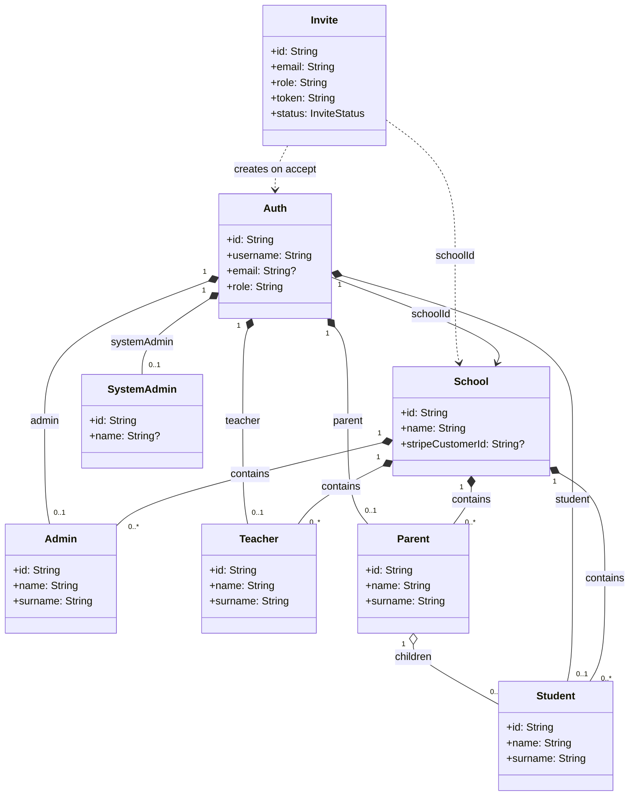
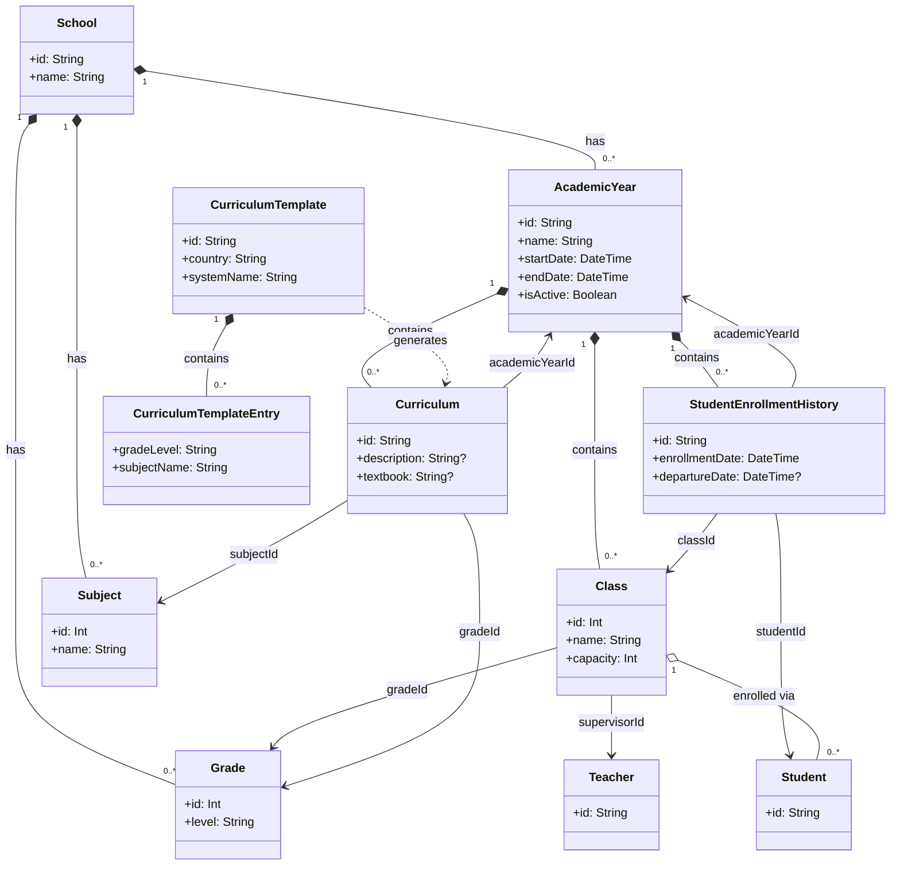
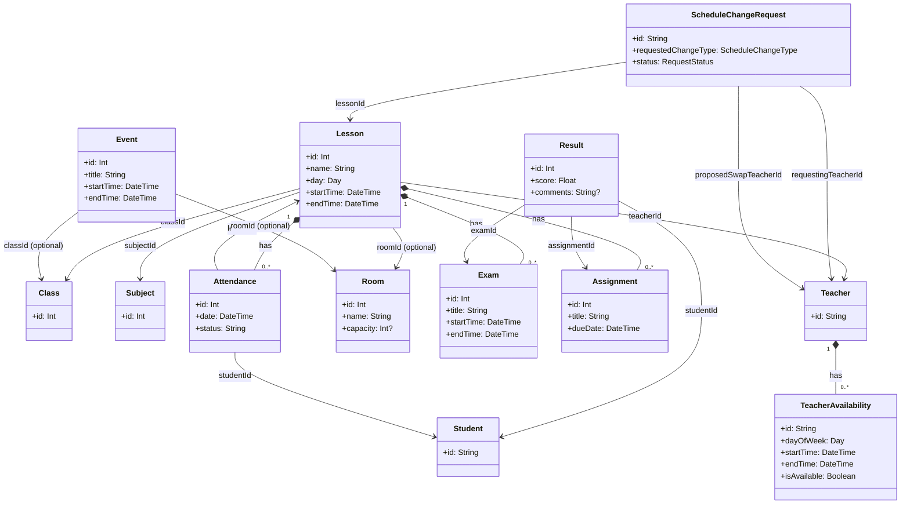
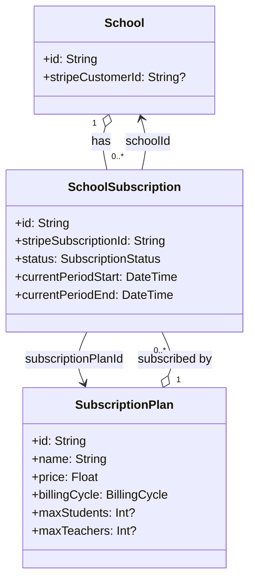
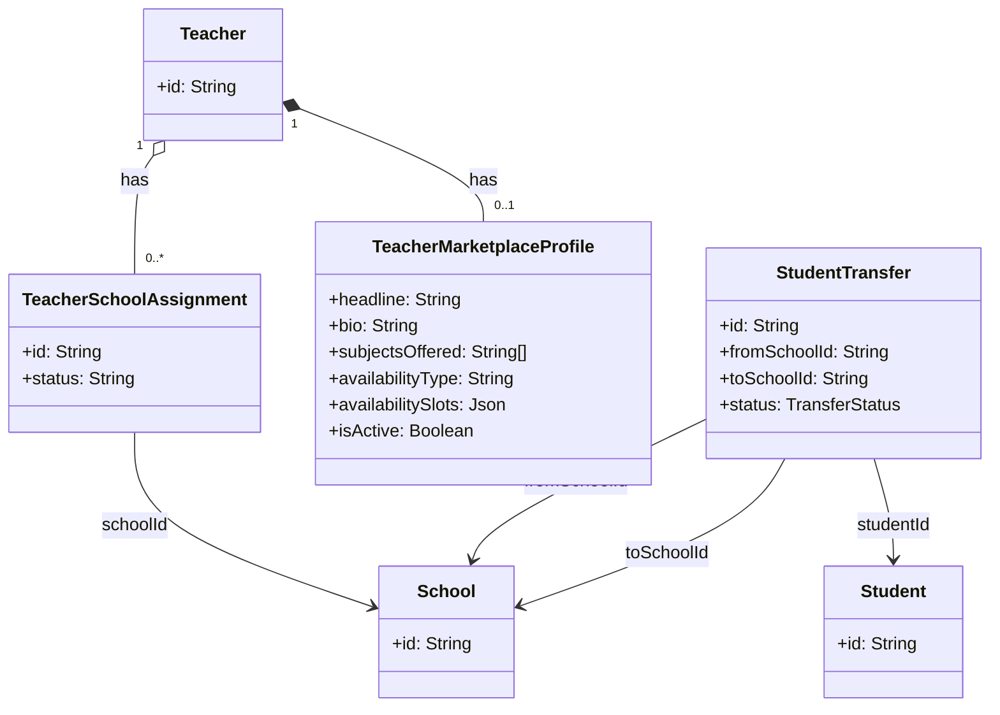

# Skooly Domain Model

This document describes the domain model for the Skooly school management platform. Entities marked with *(planned)* are described in the system design but not yet in the schema.

---

## Relationship Types (UML)

| Symbol | Type | Meaning |
|--------|------|---------|
| `◆` / `*--` | **Composition** | Strong ownership; child cannot exist without parent; lifecycle bound |
| `◇` / `o--` | **Aggregation** | Weak ownership; child can exist independently; "has-a" collection |
| `——>` | **Association** | Uses/links to; no ownership; bidirectional or directional |
| `<|——` | **Inheritance** | "Is-a" relationship; specialization |
| `- - ->` | **Dependency** | Weak usage; one depends on another for operation |

---

## Diagram 1: Core Domain (People & Tenant)

**Composition**: School *owns* Admin, Teacher, Student, Parent, Auth (school-scoped). They cannot exist without a School.

**Composition**: Auth *owns* exactly one profile (Admin, Teacher, Student, or Parent). The profile is the identity extension.

**Association**: Parent ↔ Student (many-to-many via family relationship; in schema it's Parent has many Students).

**Dependency**: Invite (planned) depends on School and creates Auth + profile on acceptance.



**Relationship summary (Diagram 1):**

| From | To | Type | Cardinality |
|------|-----|------|--------------|
| School | Admin, Teacher, Student, Parent | Composition | 1 : 0..* |
| Auth | Admin, Teacher, Student, Parent, SystemAdmin | Composition | 1 : 0..1 (exclusive) |
| Auth | School | Association | N : 1 |
| Parent | Student | Aggregation | 1 : 0..* |
| Invite | School | Dependency | N : 1 |

---

## Diagram 2: Academic Structure

**Composition**: AcademicYear *owns* Class, Curriculum, StudentEnrollmentHistory. These are scoped to a year and do not exist without it.

**Composition**: School *owns* Grade, Subject (school-level, reusable across years).

**Aggregation**: Class aggregates Students via StudentEnrollmentHistory (enrollment is the source of truth; Student can exist without Class).

**Association**: Curriculum links AcademicYear + Grade + Subject (many-to-many bridge).

**Planned**: CurriculumTemplate, CurriculumTemplateSystem for country-based templates (§11.5).



**Relationship summary (Diagram 2):**

| From | To | Type | Cardinality |
|------|-----|------|-------------|
| School | Grade, Subject, AcademicYear | Composition | 1 : 0..* |
| AcademicYear | Class, Curriculum, StudentEnrollmentHistory | Composition | 1 : 0..* |
| Class | Grade | Association | N : 1 |
| Class | Teacher | Association | N : 0..1 (supervisor) |
| Curriculum | AcademicYear, Grade, Subject | Association | N : 1 each |
| StudentEnrollmentHistory | Student, Class, AcademicYear | Association | N : 1 each |
| Class | Student | Aggregation (via enrollment) | 1 : 0..* |

---

## Diagram 3: Scheduling & Academic Activities

**Composition**: Lesson *owns* Exam, Assignment, Attendance (they are tied to a lesson and have no meaning without it).

**Aggregation**: Result aggregates Student with Exam or Assignment (Student and Exam/Assignment can exist independently).

**Association**: Lesson links Class, Subject, Teacher, Room. Room is optional.

**Composition**: ScheduleChangeRequest is owned by School and depends on Lesson and Teacher.

**Composition**: TeacherAvailability is owned by Teacher (availability slots).



**Relationship summary (Diagram 3):**

| From | To | Type | Cardinality |
|------|-----|------|-------------|
| Lesson | Class, Subject, Teacher | Association | N : 1 |
| Lesson | Room | Association | N : 0..1 |
| Lesson | Exam, Assignment, Attendance | Composition | 1 : 0..* |
| Result | Student, Exam/Assignment | Association | N : 1 |
| Attendance | Student, Lesson | Association | N : 1 each |
| ScheduleChangeRequest | Lesson, Teacher | Association | N : 1 |
| Teacher | TeacherAvailability | Composition | 1 : 0..* |

---

## Diagram 4: Billing

**Association**: SchoolSubscription links School to SubscriptionPlan. School and SubscriptionPlan can exist independently.

**Aggregation**: SchoolSubscription is the join between School and SubscriptionPlan.



**Relationship summary (Diagram 4):**

| From | To | Type | Cardinality |
|------|-----|------|-------------|
| School | SchoolSubscription | Aggregation | 1 : 0..* |
| SubscriptionPlan | SchoolSubscription | Aggregation | 1 : 0..* |
| SchoolSubscription | School, SubscriptionPlan | Association | N : 1 each |

---

## Diagram 5: Planned – Teacher Marketplace & Student Transfer

Entities from SYSTEM_DESIGN §14 and §15, not yet in the schema.

**Aggregation**: Teacher *aggregates* TeacherSchoolAssignment—a teacher can work at multiple schools; each assignment links the teacher to one school. The assignment can exist independently of the teacher’s profile (e.g. for historical records).

**Composition**: Teacher *owns* TeacherMarketplaceProfile—the marketplace profile is an extension of the teacher for discovery; it has no meaning without the teacher.

**Association**: TeacherSchoolAssignment links to School (the school where the teacher works). StudentTransfer links to Student and to two Schools (fromSchoolId, toSchoolId).

**Dependency**: StudentTransfer depends on Student and School—when the transfer completes, it updates `Student.schoolId` and `Auth.schoolId`.



**Relationship summary (Diagram 5):**

| From | To | Type | Cardinality |
|------|-----|------|-------------|
| Teacher | TeacherSchoolAssignment | Aggregation | 1 : 0..* |
| Teacher | TeacherMarketplaceProfile | Composition | 1 : 0..1 |
| TeacherSchoolAssignment | School | Association | N : 1 |
| StudentTransfer | Student | Association | N : 1 |
| StudentTransfer | School | Association | N : 1 (fromSchoolId) |
| StudentTransfer | School | Association | N : 1 (toSchoolId) |

---

---

## Cross-Diagram Dependencies

### Overview

The five domain diagrams are not isolated—they share entities and form a dependency chain. Understanding these links helps when implementing features, writing queries, or tracing data flow across the system.

```
Diagram 1 (Core) ──► Diagram 2 (Academic): School, Auth profiles
Diagram 2 (Academic) ──► Diagram 3 (Scheduling): Class, Subject, Teacher, Student
Diagram 1 (Core) ──► Diagram 4 (Billing): School
Diagram 5 (Planned) ──► Diagram 1, 2: Teacher, Student, School
```

---

### Diagram 1 → Diagram 2 (Core → Academic)

**Shared entities:** School, Teacher, Student

**Why:** The academic structure is scoped to a School. Diagram 2 introduces AcademicYear, Grade, Class, Subject, Curriculum, and StudentEnrollmentHistory—all of which belong to a School. Teacher and Student from Diagram 1 are referenced in Diagram 2:

| Diagram 2 entity | Depends on (Diagram 1) | How |
|------------------|------------------------|-----|
| AcademicYear | School | `academicYear.schoolId` → School |
| Grade | School | `grade.schoolId` → School |
| Subject | School | `subject.schoolId` → School |
| Class | School, Teacher | `class.schoolId` → School; `class.supervisorId` → Teacher |
| StudentEnrollmentHistory | Student | `enrollment.studentId` → Student |

**Implication:** You cannot create an AcademicYear, Class, or Curriculum without a School. You cannot enroll a Student in a Class without the Student (and Auth) from Diagram 1.

---

### Diagram 2 → Diagram 3 (Academic → Scheduling)

**Shared entities:** Class, Subject, Teacher, Student

**Why:** Scheduling and academic activities build on the academic structure. A Lesson is a time slot for a Class, taught by a Teacher, covering a Subject. Exams, Assignments, Attendance, and Results all depend on these entities.

| Diagram 3 entity | Depends on (Diagram 2) | How |
|------------------|------------------------|-----|
| Lesson | Class, Subject, Teacher | `lesson.classId`, `lesson.subjectId`, `lesson.teacherId` |
| Exam | Lesson | `exam.lessonId` → Lesson (Lesson links to Class, Subject, Teacher) |
| Assignment | Lesson | `assignment.lessonId` → Lesson |
| Attendance | Lesson, Student | `attendance.lessonId` → Lesson; `attendance.studentId` → Student |
| Result | Student, Exam/Assignment | `result.studentId` → Student; `result.examId` or `result.assignmentId` |

**Implication:** You cannot create a Lesson without a Class (which implies AcademicYear), Subject, and Teacher. Attendance and Results require Students who are enrolled in the Lesson’s Class (via StudentEnrollmentHistory). The curriculum check (Lesson’s Subject must be in the Class’s grade curriculum) crosses Diagram 2 and 3.

---

### Diagram 1 → Diagram 4 (Core → Billing)

**Shared entities:** School

**Why:** Billing is at the school level. A School subscribes to a SubscriptionPlan via SchoolSubscription. SubscriptionPlan is global (not owned by any School); SchoolSubscription is the join.

| Diagram 4 entity | Depends on (Diagram 1) | How |
|------------------|------------------------|-----|
| SchoolSubscription | School | `schoolSubscription.schoolId` → School |

**Implication:** A School must exist before it can have a subscription. The School’s `stripeCustomerId` (Diagram 1) is used when creating or managing subscriptions.

---

### Diagram 5 → Diagrams 1 & 2 (Planned → Core & Academic)

**Shared entities:** Teacher, Student, School

**Why:** The planned Teacher Marketplace and Student Transfer features extend the current model. They introduce new entities but rely on existing ones.

| Diagram 5 entity | Depends on | How |
|-------------------|------------|-----|
| TeacherSchoolAssignment | Teacher, School | Links a Teacher to a School; replaces or supplements `Teacher.schoolId` for multi-school support |
| TeacherMarketplaceProfile | Teacher | Extends Teacher with marketplace-specific fields (headline, availabilitySlots, etc.) |
| StudentTransfer | Student, School | `fromSchoolId`, `toSchoolId` reference Schools; `studentId` references Student; transfer updates `Student.schoolId` |

**Implication:** TeacherSchoolAssignment changes the Teacher–School relationship from 1:1 to N:N. StudentTransfer changes Student.schoolId when a transfer completes. Parent access may become derived from children’s schools (Diagram 1) rather than a single Parent.schoolId.

---

### Dependency Flow (Top-Down)

```
                    ┌─────────────┐
                    │  Diagram 1  │
                    │   (Core)    │
                    │ School, Auth│
                    │ Admin, etc. │
                    └──────┬──────┘
                           │
              ┌────────────┼────────────┐
              │            │            │
              ▼            ▼            ▼
       ┌──────────┐ ┌──────────┐ ┌──────────┐
       │Diagram 2  │ │Diagram 4  │ │Diagram 5 │
       │(Academic)│ │(Billing) │ │(Planned) │
       └────┬─────┘ └──────────┘ └──────────┘
            │
            ▼
       ┌──────────┐
       │Diagram 3 │
       │(Schedul.)│
       └──────────┘
```

**Order of creation (typical):** School → Auth + profiles → AcademicYear → Grade, Subject → Class → Curriculum → StudentEnrollmentHistory → Lesson → Exam, Assignment, Attendance, Result.

---

### Reverse Dependencies (Queries & Navigation)

Dependencies also flow in reverse when reading data:

- **"Show a student's schedule"**: Student (1) → StudentEnrollmentHistory (2) → Class (2) → Lesson (3)
- **"List lessons for a teacher"**: Teacher (1) → Lesson (3) → Class, Subject (2)
- **"Check if school can add more students"**: School (1) → SchoolSubscription (4) → SubscriptionPlan (4) → maxStudents
