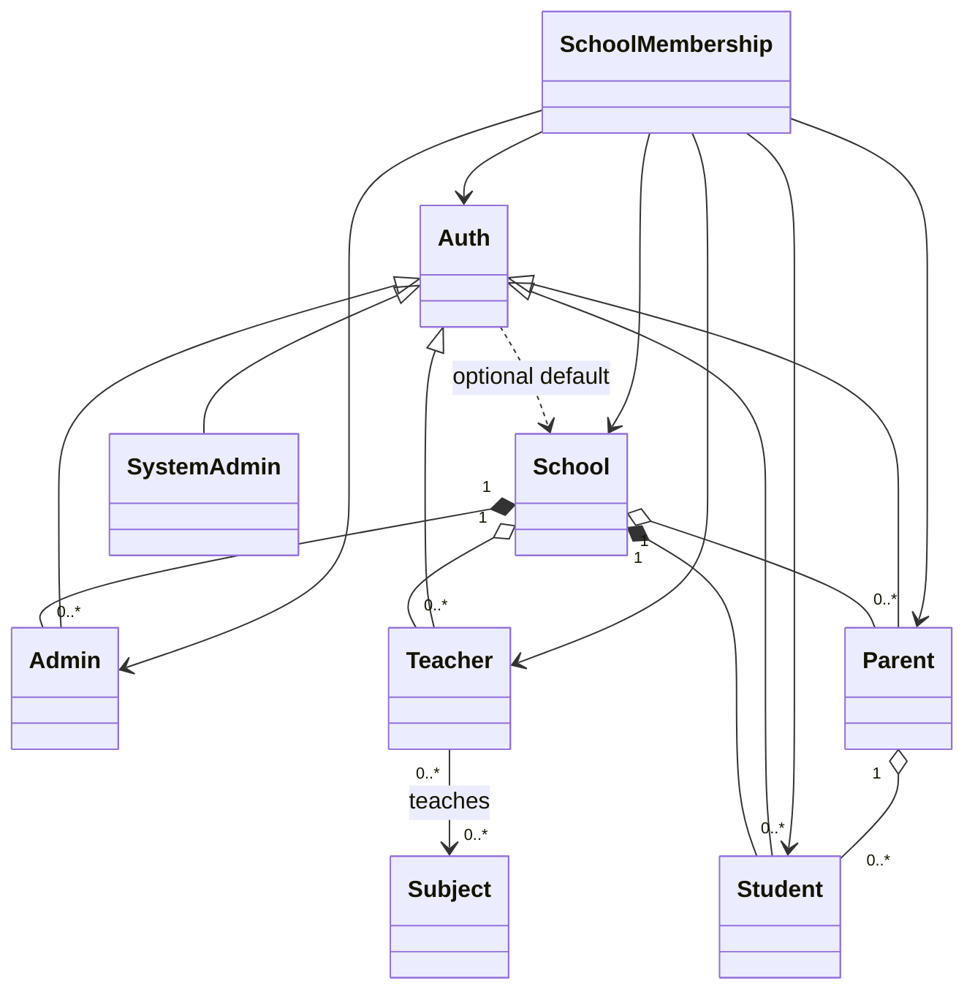
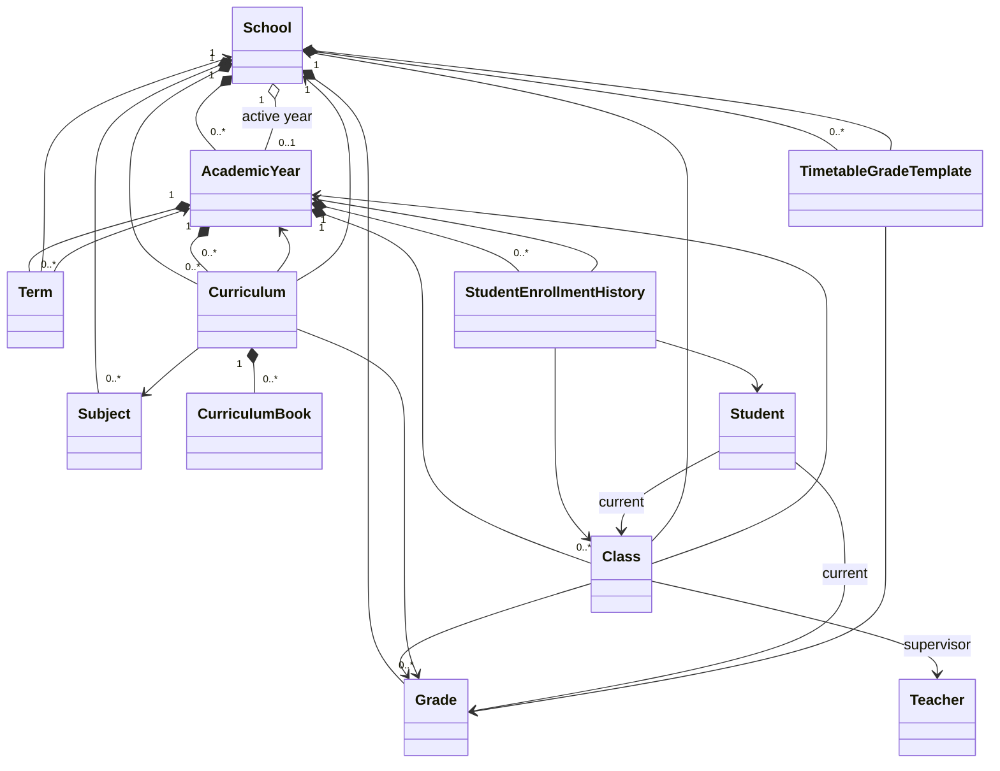
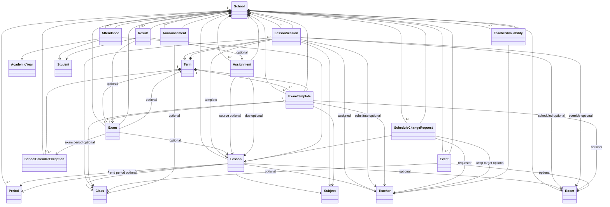
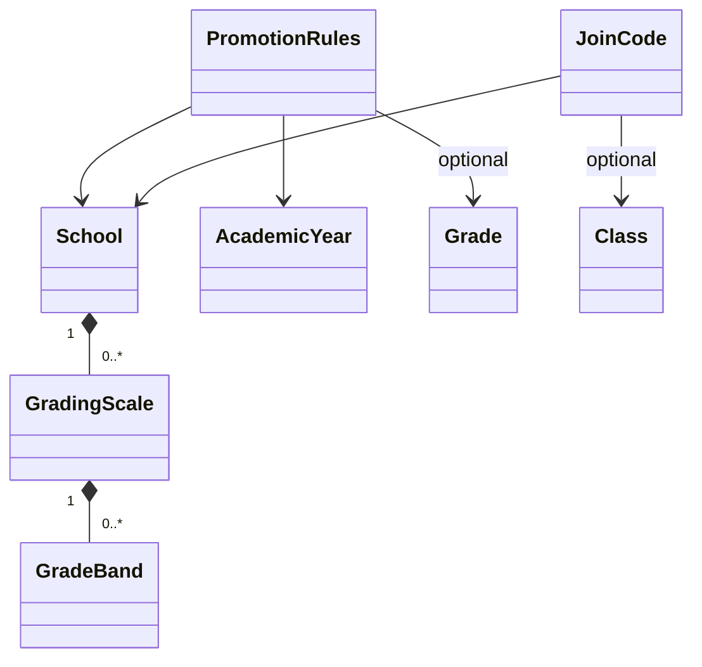
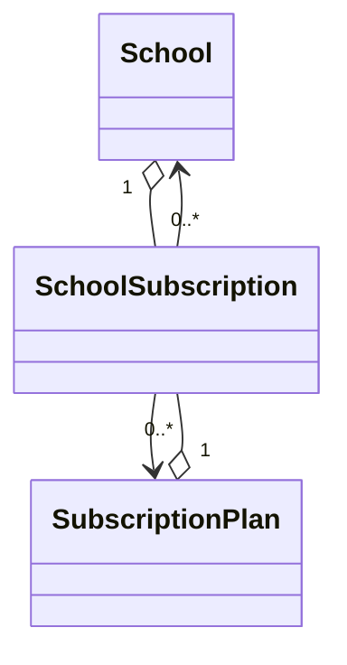
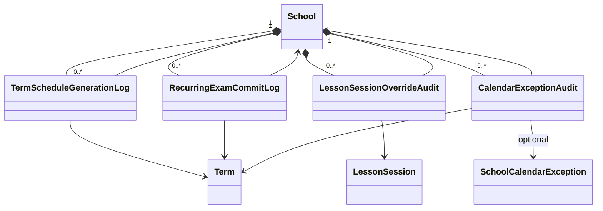
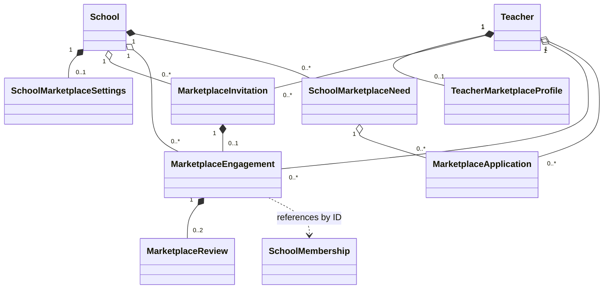

# Skooly Domain Model

This document describes **entities, relationships, and enums** for the Skooly school management platform. All diagrams match the current Prisma schema: **48 models** and **19 enums** across 7 domains. Diagrams are kept **separated by domain** for readability with cross-references documented at the end.

Implementation may still **fall back** to `Auth.schoolId` when no membership rows exist; see [`docs/AUTH_SCHOOL_CONTEXT.md`](docs/AUTH_SCHOOL_CONTEXT.md).

---

## Relationship Types (UML)

| Symbol | Type | Meaning |
|--------|------|---------|
| `*--` | **Composition** | Strong ownership; child cannot exist without parent; lifecycle bound (required FK + cascade) |
| `o--` | **Aggregation** | Weak ownership; child can exist independently; optional FK or "has-a" collection |
| `-->` | **Association** | Uses/links to; no ownership; required or optional reference |
| `..>` | **Dependency** | Weak usage; one depends on another for operation (no FK) |
| `<\|--` | **Generalization** | "Is-a" / specialization; child extends or depends on parent for identity (empty triangle arrow) |

---

## Diagram 1: Core Domain (People & Tenant)

### Identity vs Tenant Access

| Layer | Responsibility |
|-------|----------------|
| **Auth** | **Identity** — who can sign in (session subject). |
| **SchoolMembership** | **Tenant access** — which School(s), role, and profile apply per context. |

**Rules:**

- Prefer **active membership** for current school and role.
- **Teacher**, **Parent**, **School admin**: multiple active memberships (multi-school).
- **Student**: one active membership at a time.
- **System admin**: outside school membership graph.



**Relationship descriptions:**

| # | From | To | Type | Cardinality | Description |
|---|------|-----|------|-------------|-------------|
| 1 | School | Admin | Composition | 1 : 0..* | A school owns its admin profiles. Admin.schoolId is required; cascade delete. |
| 2 | School | Teacher | Aggregation | 1 : 0..* | A school has teachers, but Teacher.schoolId is optional (multi-school teachers may have null home school). |
| 3 | School | Student | Composition | 1 : 0..* | A school owns its students. Student.schoolId is required; cascade delete. |
| 4 | School | Parent | Aggregation | 1 : 0..* | A school has parents, but Parent.schoolId is optional (multi-school parents). |
| 5 | Admin | Auth | Generalization | 0..1 : 1 | An admin is a specialization of Auth. authId is required and unique. |
| 6 | Teacher | Auth | Generalization | 0..1 : 1 | A teacher is a specialization of Auth. authId is required and unique. |
| 7 | Student | Auth | Generalization | 0..1 : 1 | A student is a specialization of Auth. authId is required and unique. |
| 8 | Parent | Auth | Generalization | 0..1 : 1 | A parent is a specialization of Auth. authId is required and unique. |
| 9 | SystemAdmin | Auth | Generalization | 0..1 : 1 | A system admin is a specialization of Auth. authId is required and unique. |
| 10 | Auth | School | Dependency | N : 0..1 | Optional legacy default school on the auth row. Not authoritative for tenant; membership is. |
| 11 | SchoolMembership | Auth | Association | 0..* : 1 | Each membership references one Auth (the user). authId is required. Cascade delete. |
| 12 | SchoolMembership | School | Association | N : 1 | Each membership row belongs to exactly one school. Required FK. |
| 13 | SchoolMembership | Admin | Association | N : 0..1 | Optional pointer to the admin profile for this membership context. |
| 14 | SchoolMembership | Teacher | Association | N : 0..1 | Optional pointer to the teacher profile for this membership context. |
| 15 | SchoolMembership | Student | Association | N : 0..1 | Optional pointer to the student profile for this membership context. |
| 16 | SchoolMembership | Parent | Association | N : 0..1 | Optional pointer to the parent profile for this membership context. |
| 17 | Parent | Student | Aggregation | 1 : 0..* | A parent has zero or more children (students). Student.parentId is required. |
| 18 | Teacher | Subject | Association (M:N) | 0..* : 0..* | Implicit many-to-many join table. A teacher can teach multiple subjects; a subject can have multiple teachers. |

**Membership cardinality:**

| Persona | Active rows per Auth |
|---------|---------------------|
| Teacher, Parent, School admin | 0..* (multi-school) |
| Student | 0..1 active |
| System admin | N/A |

---

## Diagram 2: Academic Structure



**Relationship descriptions:**

| # | From | To | Type | Cardinality | Description |
|---|------|-----|------|-------------|-------------|
| 1 | School | AcademicYear | Composition | 1 : 0..* | A school owns its academic years. Required FK; cascade delete. |
| 2 | School | Grade | Composition | 1 : 0..* | A school owns its grade levels (e.g. Grade 1-6). Required FK; cascade delete. |
| 3 | School | Subject | Composition | 1 : 0..* | A school owns its subject catalog. Required FK; cascade delete. |
| 4 | School | Curriculum | Composition | 1 : 0..* | A school owns curriculum rows (linking year x grade x subject). FK uses onDelete: NoAction. |
| 5 | School | TimetableGradeTemplate | Composition | 1 : 0..* | A school owns timetable templates per grade. Required FK; cascade delete. |
| 6 | School | AcademicYear (active) | Aggregation | 1 : 0..1 | A school optionally points to one active academic year. SetNull on delete. |
| 7 | AcademicYear | Class | Composition | 1 : 0..* | An academic year owns its classes. Required FK; cascade delete. |
| 8 | AcademicYear | Curriculum | Composition | 1 : 0..* | An academic year owns its curriculum entries. Required FK; cascade delete. |
| 9 | AcademicYear | StudentEnrollmentHistory | Composition | 1 : 0..* | An academic year owns enrollment history records. Required FK; cascade delete. |
| 10 | AcademicYear | Term | Composition | 1 : 0..* | An academic year is divided into terms (e.g. Fall, Winter, Spring). Required FK; cascade delete. |
| 11 | Term | School | Association | N : 1 | Each term belongs to one school. Required FK; cascade delete. |
| 12 | Term | AcademicYear | Association | N : 1 | Each term belongs to one academic year. Required FK; cascade delete. |
| 13 | Class | School | Association | N : 1 | Each class belongs to one school. Required FK; cascade delete. |
| 14 | Class | Grade | Association | N : 1 | Each class is assigned to one grade level. Required FK. |
| 15 | Class | AcademicYear | Association | N : 1 | Each class belongs to one academic year. Required FK; cascade delete. |
| 16 | Class | Teacher (supervisor) | Association | N : 0..1 | A class may have one supervising teacher. Optional FK. |
| 17 | Curriculum | AcademicYear | Association | N : 1 | Each curriculum entry belongs to one academic year. |
| 18 | Curriculum | Grade | Association | N : 1 | Each curriculum entry targets one grade. Cascade delete. |
| 19 | Curriculum | Subject | Association | N : 1 | Each curriculum entry is for one subject. Cascade delete. |
| 20 | Curriculum | School | Association | N : 1 | Each curriculum entry belongs to one school (integrity guard). |
| 21 | Curriculum | CurriculumBook | Composition | 1 : 0..* | A curriculum entry owns its book/resource records. Cascade delete. |
| 22 | StudentEnrollmentHistory | Student | Association | N : 1 | Each enrollment record references one student. Cascade delete. |
| 23 | StudentEnrollmentHistory | Class | Association | N : 1 | Each enrollment record references one class. Cascade delete. |
| 24 | StudentEnrollmentHistory | AcademicYear | Association | N : 1 | Each enrollment record references one academic year. Cascade delete. |
| 25 | Student | Class | Association | N : 0..1 | A student may be currently assigned to one class. Optional FK; SetNull on class delete. |
| 26 | Student | Grade | Association | N : 0..1 | A student may be assigned a current grade level. Optional FK; SetNull on grade delete. |
| 27 | TimetableGradeTemplate | School | Association | N : 1 | Each template belongs to one school. Cascade delete. Unique per (school, grade). |
| 28 | TimetableGradeTemplate | Grade | Association | N : 1 | Each template targets one grade. Cascade delete. |

---

## Diagram 3: Scheduling, Calendar & Academic Activities



**Relationship descriptions:**

| # | From | To | Type | Cardinality | Description |
|---|------|-----|------|-------------|-------------|
| 1 | School | Period | Composition | 1 : 0..* | A school owns its bell schedule periods. Cascade delete. |
| 2 | School | Lesson | Composition | 1 : 0..* | A school owns weekly lesson templates. Cascade delete. |
| 3 | School | LessonSession | Composition | 1 : 0..* | A school owns dated lesson instances. Cascade delete. |
| 4 | School | ExamTemplate | Composition | 1 : 0..* | A school owns recurring exam templates. Cascade delete. |
| 5 | School | Exam | Composition | 1 : 0..* | A school owns exam records. Cascade delete. |
| 6 | School | Assignment | Composition | 1 : 0..* | A school owns assignment records. Cascade delete. |
| 7 | School | Attendance | Composition | 1 : 0..* | A school owns attendance records. Cascade delete. |
| 8 | School | Result | Composition | 1 : 0..* | A school owns result/score records. Cascade delete. |
| 9 | School | Room | Composition | 1 : 0..* | A school owns its physical rooms. Cascade delete. |
| 10 | School | Event | Composition | 1 : 0..* | A school owns calendar events. Cascade delete. |
| 11 | School | Announcement | Composition | 1 : 0..* | A school owns announcements. Cascade delete. |
| 12 | School | TeacherAvailability | Composition | 1 : 0..* | A school owns teacher availability slots. Cascade delete. |
| 13 | School | ScheduleChangeRequest | Composition | 1 : 0..* | A school owns schedule change requests. Cascade delete. |
| 14 | School | SchoolCalendarException | Composition | 1 : 0..* | A school owns calendar exceptions (holidays, breaks, exam periods). Cascade delete. |
| 15 | Term | LessonSession | Composition | 1 : 0..* | A term owns its generated lesson sessions. Cascade delete. |
| 16 | Term | ExamTemplate | Composition | 1 : 0..* | A term owns recurring exam templates. |
| 17 | Term | SchoolCalendarException | Composition | 1 : 0..* | A term owns its calendar exceptions. Cascade delete. |
| 18 | Term | Exam | Aggregation | 1 : 0..* | A term may have exams linked to it. Exam.termId is optional; SetNull on delete. |
| 19 | Lesson | Class | Association | N : 1 | Each lesson template is for one class. Required FK. |
| 20 | Lesson | Subject | Association | N : 1 | Each lesson template teaches one subject. Required FK. |
| 21 | Lesson | Teacher | Association | N : 1 | Each lesson template is assigned to one teacher. Required FK. |
| 22 | Lesson | Room | Association | N : 0..1 | A lesson may be assigned a room. Null for online lessons. SetNull on delete. |
| 23 | Lesson | Period (start) | Association | N : 0..1 | A lesson may map to a start bell period. SetNull on delete. |
| 24 | Lesson | Period (end) | Association | N : 0..1 | For multi-block lessons, an end period. Null means single period. SetNull on delete. |
| 25 | LessonSession | Term | Association | N : 1 | Each session belongs to one term. Cascade delete. |
| 26 | LessonSession | Lesson (template) | Association | N : 1 | Each session is generated from one lesson template. Cascade delete. |
| 27 | LessonSession | School | Association | N : 1 | Each session belongs to one school. Cascade delete. |
| 28 | LessonSession | Class | Association | N : 1 | Each session is for one class. Required FK. |
| 29 | LessonSession | Subject | Association | N : 1 | Each session is for one subject (denormalized from template). Required FK. |
| 30 | LessonSession | Teacher (assigned) | Association | N : 1 | Primary teacher for this session. Required FK. |
| 31 | LessonSession | Room (scheduled) | Association | N : 0..1 | Scheduled room (from template). Optional; SetNull on delete. |
| 32 | LessonSession | Teacher (substitute) | Association | N : 0..1 | Optional substitute teacher override. SetNull on delete. |
| 33 | LessonSession | Room (override) | Association | N : 0..1 | Optional room override (admin moved the session). SetNull on delete. |
| 34 | ExamTemplate | School | Association | N : 1 | Each exam template belongs to one school. Cascade delete. |
| 35 | ExamTemplate | Term | Association | N : 1 | Each exam template is scoped to one term. |
| 36 | ExamTemplate | Class | Association | N : 1 | Each exam template targets one class. |
| 37 | ExamTemplate | Subject | Association | N : 1 | Each exam template is for one subject. |
| 38 | ExamTemplate | Teacher | Association | N : 1 | Each exam template is assigned to one teacher. |
| 39 | ExamTemplate | Room | Association | N : 0..1 | Optional room for the exam. |
| 40 | ExamTemplate | Exam | Aggregation | 1 : 0..* | A template generates zero or more exam instances. SetNull on delete. |
| 41 | Exam | School | Association | N : 1 | Each exam belongs to one school. Cascade delete. |
| 42 | Exam | Lesson | Association | N : 0..1 | An exam may link to a lesson (subject/class context). Optional FK. |
| 43 | Exam | Term | Association | N : 0..1 | An exam may belong to a term. Optional FK; SetNull on delete. |
| 44 | Exam | SchoolCalendarException | Association | N : 0..1 | An exam may fall within a declared exam period window. Optional FK; SetNull on delete. |
| 45 | Assignment | School | Association | N : 1 | Each assignment belongs to one school. Cascade delete. |
| 46 | Assignment | Lesson (source) | Association | N : 0..1 | The lesson that assigned this work. Optional FK; SetNull on delete. |
| 47 | Assignment | Lesson (due) | Association | N : 0..1 | The lesson on which this assignment is due. Optional FK; SetNull on delete. |
| 48 | Attendance | School | Association | N : 1 | Each attendance record belongs to one school. Cascade delete. |
| 49 | Attendance | Lesson | Association | N : 1 | Each attendance record is for one lesson. Required FK. |
| 50 | Attendance | Student | Association | N : 1 | Each attendance record is for one student. Required FK. |
| 51 | Attendance | AcademicYear | Association | N : 1 | Each attendance record belongs to one academic year. |
| 52 | Result | School | Association | N : 1 | Each result belongs to one school. Cascade delete. |
| 53 | Result | Student | Association | N : 1 | Each result is for one student. Required FK. |
| 54 | Result | Exam | Association | N : 0..1 | A result may be for an exam. Optional FK (XOR with assignment at app level). |
| 55 | Result | Assignment | Association | N : 0..1 | A result may be for an assignment. Optional FK (XOR with exam at app level). |
| 56 | ScheduleChangeRequest | School | Association | N : 1 | Each request belongs to one school. Cascade delete. |
| 57 | ScheduleChangeRequest | Lesson | Association | N : 1 | Each request targets one lesson. Cascade delete. |
| 58 | ScheduleChangeRequest | Teacher (requester) | Association | N : 1 | The teacher who submitted the request. Cascade delete. |
| 59 | ScheduleChangeRequest | Teacher (swap target) | Association | N : 0..1 | For SWAP type: the proposed swap teacher. Optional; NoAction on delete. |
| 60 | TeacherAvailability | Teacher | Association | N : 1 | Each availability slot belongs to one teacher. Cascade delete. |
| 61 | TeacherAvailability | School | Association | N : 1 | Each availability slot is scoped to one school. Cascade delete. Unique per (teacher, day, time, school). |
| 62 | Event | School | Association | N : 1 | Each event belongs to one school. Cascade delete. |
| 63 | Event | Class | Association | N : 0..1 | An event may target a specific class. Optional FK; cascade delete. |
| 64 | Event | Room | Association | N : 0..1 | An event may be in a room. Optional FK; SetNull on delete. |
| 65 | Announcement | School | Association | N : 1 | Each announcement belongs to one school. Cascade delete. |
| 66 | Announcement | Class | Association | N : 0..1 | An announcement may target a specific class. Optional FK. |

---

## Diagram 4: Grading, Promotion & Join Access



**Relationship descriptions:**

| # | From | To | Type | Cardinality | Description |
|---|------|-----|------|-------------|-------------|
| 1 | School | GradingScale | Composition | 1 : 0..* | A school owns its grading scales. Cascade delete. |
| 2 | GradingScale | GradeBand | Composition | 1 : 0..* | A grading scale owns its band entries (letter grades / ranges). Cascade delete. |
| 3 | PromotionRules | School | Association | N : 1 | Each promotion rule set belongs to one school. Cascade delete. |
| 4 | PromotionRules | AcademicYear | Association | N : 1 | Each promotion rule set is for one academic year. |
| 5 | PromotionRules | Grade | Association | N : 0..1 | A promotion rule set may target a specific grade. Optional FK. Unique per (school, year, grade). |
| 6 | JoinCode | School | Association | N : 1 | Each join code belongs to one school. Cascade delete. |
| 7 | JoinCode | Class | Association | N : 0..1 | A join code may be scoped to one class (for CLASS_STUDENT type). Optional FK; cascade delete. |

---

## Diagram 5: Billing



**Relationship descriptions:**

| # | From | To | Type | Cardinality | Description |
|---|------|-----|------|-------------|-------------|
| 1 | School | SchoolSubscription | Aggregation | 1 : 0..* | A school can have multiple subscriptions (active, past, etc.). |
| 2 | SubscriptionPlan | SchoolSubscription | Aggregation | 1 : 0..* | A plan can be subscribed to by many schools. |
| 3 | SchoolSubscription | School | Association | N : 1 | Each subscription belongs to one school. Required FK. |
| 4 | SchoolSubscription | SubscriptionPlan | Association | N : 1 | Each subscription references one plan. Required FK. |

---

## Diagram 6: Scheduling & Calendar Operations (Audit)

Audit tables record pipeline runs and administrative edits. They support troubleshooting and accountability.



**Relationship descriptions:**

| # | From | To | Type | Cardinality | Description |
|---|------|-----|------|-------------|-------------|
| 1 | School | TermScheduleGenerationLog | Composition | 1 : 0..* | A school owns its generation run logs. Cascade delete. |
| 2 | School | RecurringExamCommitLog | Composition | 1 : 0..* | A school owns its recurring exam commit logs. Cascade delete. |
| 3 | School | LessonSessionOverrideAudit | Composition | 1 : 0..* | A school owns lesson session override audits. Cascade delete. |
| 4 | School | CalendarExceptionAudit | Composition | 1 : 0..* | A school owns calendar exception audits. Cascade delete. |
| 5 | TermScheduleGenerationLog | Term | Association | N : 1 | Each log references the term it was generated for. Cascade delete. |
| 6 | RecurringExamCommitLog | Term | Association | N : 1 | Each log references the term. Cascade delete. |
| 7 | LessonSessionOverrideAudit | LessonSession | Association | N : 1 | Each audit references the session that was overridden. Cascade delete. |
| 8 | CalendarExceptionAudit | Term | Association | N : 1 | Each audit references the term. Cascade delete. |
| 9 | CalendarExceptionAudit | SchoolCalendarException | Association | N : 0..1 | May reference the exception (null if the exception was deleted). SetNull on delete. |

---

## Diagram 7: Teacher Marketplace

The marketplace enables two-sided discovery: teachers opt in with a profile; schools opt in via settings; invitations flow from schools to teachers; accepted invitations create SchoolMemberships and tracked engagements; reviews build trust; needs boards let schools post openings and teachers apply.



**Relationship descriptions:**

| # | From | To | Type | Cardinality | Description |
|---|------|-----|------|-------------|-------------|
| 1 | Teacher | TeacherMarketplaceProfile | Composition | 1 : 0..1 | A teacher may opt in with one marketplace profile. Cascade delete. |
| 2 | School | SchoolMarketplaceSettings | Composition | 1 : 0..1 | A school has at most one marketplace settings row. Cascade delete. |
| 3 | School | MarketplaceInvitation | Aggregation | 1 : 0..* | A school can send many invitations. Cascade delete. |
| 4 | Teacher | MarketplaceInvitation | Aggregation | 1 : 0..* | A teacher can receive many invitations from different schools. Cascade delete. |
| 5 | MarketplaceInvitation | MarketplaceEngagement | Composition | 1 : 0..1 | An accepted invitation creates exactly one engagement. Unique FK on invitationId. |
| 6 | School | MarketplaceEngagement | Aggregation | 1 : 0..* | A school can have many active engagements. Cascade delete. |
| 7 | Teacher | MarketplaceEngagement | Aggregation | 1 : 0..* | A teacher can have engagements at multiple schools. Cascade delete. |
| 8 | MarketplaceEngagement | MarketplaceReview | Composition | 1 : 0..2 | Each engagement can have at most two reviews: one from the school, one from the teacher. Unique per (engagement, reviewerRole). Cascade delete. |
| 9 | MarketplaceEngagement | SchoolMembership | Dependency | N : 0..1 | References a SchoolMembership by ID (no FK constraint). Created on acceptance to integrate teacher into school's scheduling system. |
| 10 | School | SchoolMarketplaceNeed | Composition | 1 : 0..* | A school can post many open positions. Cascade delete. |
| 11 | SchoolMarketplaceNeed | MarketplaceApplication | Aggregation | 1 : 0..* | A posted need can receive many applications. Cascade delete. |
| 12 | Teacher | MarketplaceApplication | Aggregation | 1 : 0..* | A teacher can apply to many needs. Unique per (need, teacher). Cascade delete. |

**Marketplace flow:**

1. Teacher publishes a TeacherMarketplaceProfile (subject tags, availability, rate).
2. School enables marketplace via SchoolMarketplaceSettings.
3. Admin searches profiles (excludes own school teachers) and sends MarketplaceInvitation.
4. Teacher accepts -> transaction creates SchoolMembership + MarketplaceEngagement.
5. Teacher is now in the school's teaching pool (visible to timetable assistant, assignable to lessons).
6. Admin ends engagement -> optionally deactivates membership -> both sides can leave MarketplaceReview.
7. Schools post SchoolMarketplaceNeed; teachers with matching subjects see them and submit MarketplaceApplication.

---

## Enums Reference

19 enums define the valid values for status fields, types, and categories across the domain.

### Diagram 1 (Core)

| Enum | Values | Used By |
|------|--------|---------|
| **AccountType** | `SCHOOL_ADMIN`, `TEACHER`, `STUDENT`, `PARENT`, `SYSTEM_ADMIN` | Auth.accountType — determines the type of account at creation. |
| **UserSex** | `MALE`, `FEMALE`, `OTHER` | Teacher.sex, Student.sex — demographic field on profiles. |

### Diagram 2 (Academic)

| Enum | Values | Used By |
|------|--------|---------|
| **Day** | `MONDAY` .. `SUNDAY` | Lesson.day, LessonSession.day, TeacherAvailability.dayOfWeek — weekday for scheduling. |
| **EnrollmentStatus** | `ENROLLED`, `PROMOTED`, `REPEATED`, `WITHDRAWN`, `COMPLETED`, `GRADUATED` | StudentEnrollmentHistory.status — lifecycle of a student's enrollment in a class. |
| **CurriculumBookRole** | `primary`, `supplementary`, `workbook`, `reader`, `teacher`, `digital`, `other` | CurriculumBook.role — classification of a teaching resource. |

### Diagram 3 (Scheduling & Activities)

| Enum | Values | Used By |
|------|--------|---------|
| **LessonDeliveryMode** | `IN_PERSON`, `ONLINE` | Lesson.deliveryMode, LessonSession.deliveryMode — whether teaching is physical or remote. Both count toward teacher overlap. |
| **LessonSessionStatus** | `SCHEDULED`, `CANCELLED` | LessonSession.status — runtime state of a generated session instance. |
| **CalendarExceptionType** | `HOLIDAY`, `BREAK`, `EXAM_PERIOD` | SchoolCalendarException.type — what kind of calendar block this is. Generation skips days inside any type. |
| **ExamCategory** | `COURSE_EXAM`, `POP_QUIZ` | Exam.examCategory — distinguishes full exams from in-class quizzes (affects calendar badges). |
| **AttendanceStatus** | `PRESENT`, `ABSENT`, `LATE` | Attendance.status — per-student per-lesson attendance mark. |
| **ScheduleChangeType** | `TIME_CHANGE`, `SWAP` | ScheduleChangeRequest.requestedChangeType — what kind of schedule change a teacher requests. |
| **RequestStatus** | `PENDING`, `APPROVED`, `REJECTED`, `CANCELED` | ScheduleChangeRequest.status — lifecycle of a teacher's schedule change request. |

### Diagram 4 (Grading & Join)

| Enum | Values | Used By |
|------|--------|---------|
| **JoinCodeType** | `CLASS_STUDENT`, `TEACHER_INVITE`, `PARENT_LINK` | JoinCode.type — determines the onboarding flow: enroll parent+student, invite a teacher, or link a parent to an existing student. |

### Diagram 5 (Billing)

| Enum | Values | Used By |
|------|--------|---------|
| **BillingCycle** | `MONTHLY`, `YEARLY` | SubscriptionPlan.billingCycle — payment frequency. |
| **SubscriptionStatus** | `ACTIVE`, `CANCELED`, `PAST_DUE`, `INCOMPLETE`, `INCOMPLETE_EXPIRED`, `TRIALING`, `UNPAID` | SchoolSubscription.status — Stripe subscription lifecycle states. |

### Diagram 7 (Marketplace)

| Enum | Values | Used By |
|------|--------|---------|
| **MarketplaceInvitationStatus** | `PENDING`, `ACCEPTED`, `DECLINED`, `WITHDRAWN`, `EXPIRED` | MarketplaceInvitation.status — lifecycle of a school-to-teacher invitation. |
| **EngagementStatus** | `ACTIVE`, `COMPLETED`, `TERMINATED` | MarketplaceEngagement.status — lifecycle of a working relationship. |
| **ReviewerRole** | `SCHOOL`, `TEACHER` | MarketplaceReview.reviewerRole — which side left the review. Unique per (engagement, role). |
| **ApplicationStatus** | `PENDING`, `REVIEWED`, `ACCEPTED`, `REJECTED` | MarketplaceApplication.status — lifecycle of a teacher's application to an open position. |

---

## Cross-Diagram Dependencies

### Overview

```
Diagram 1 (Core) --> Diagram 2 (Academic): School, Teacher, Student
Diagram 2 (Academic) --> Diagram 3 (Scheduling): Class, Subject, Teacher, Student, Term, AcademicYear
Diagram 1 (Core) --> Diagram 4 (Grading / Join): School, Grade, AcademicYear
Diagram 1 (Core) --> Diagram 5 (Billing): School
Diagrams 2 & 3 --> Diagram 6 (Audit): School, Term, LessonSession, SchoolCalendarException
Diagram 1 (Core) --> Diagram 7 (Marketplace): Teacher, School, SchoolMembership
```

### Dependency Flow

```
                    +-------------+
                    |  Diagram 1  |
                    |   (Core)    |
                    +------+------+
                           |
         +-----------------+-----------------+-----------+
         |                 |                 |           |
         v                 v                 v           v
  +------------+    +------------+    +------------+ +------------+
  | Diagram 2  |    | Diagram 4  |    | Diagram 5  | | Diagram 7  |
  | (Academic) |    | (Grade/    |    | (Billing)  | |(Marketplace)|
  |            |    |  Join)     |    |            | |            |
  +-----+------+    +------------+    +------------+ +-----+------+
        |                                                  |
        v                                                  |
  +------------+    +------------+                         |
  | Diagram 3  |--->| Diagram 6  |                         |
  | (Schedule) |    | (Audit)    |                         |
  +------+-----+    +------------+                         |
         |                                                 |
         +------------- SchoolMembership ------------------+
```

**Key cross-diagram links:**

- **Marketplace -> Core -> Scheduling**: Accepted invitations create SchoolMembership rows (Diagram 1), making marketplace teachers available to the scheduling system (Diagram 3).
- **Scheduling -> Academic**: Lessons, sessions, exams, and attendance all reference Class, Subject, Teacher, and Term from the academic structure.
- **Audit -> Scheduling**: Audit tables reference Term, LessonSession, and SchoolCalendarException.

### Typical Setup Order

School and people -> academic year, grades, subjects, terms -> classes, curriculum, enrollments -> bell periods and weekly lessons -> generated lesson sessions and exams -> assignments, attendance, results. Billing, grading, and marketplace configuration can run in parallel once the school exists.

### Reverse Dependencies (Queries)

- **Student schedule (dated):** Student -> Class -> LessonSession (by Term).
- **Teacher schedule:** Teacher -> Lesson and LessonSession by date; merged across schools via SchoolMembership.
- **Parent dashboard:** Parent -> Students (across all SchoolMembership schools) -> per-child schedule, grades, attendance.
- **Exam calendar:** Exam -> Term, optional ExamTemplate, optional SchoolCalendarException.
- **Marketplace search:** TeacherMarketplaceProfile (published, excluding own school) -> Teacher -> reviews via MarketplaceEngagement.
- **Subscription limits:** School -> SchoolSubscription -> SubscriptionPlan caps.

---

## Entity Count Summary

| Diagram | Models | Count |
|---------|--------|-------|
| 1. Core | School, Auth, Admin, Teacher, Student, Parent, SystemAdmin, SchoolMembership | 8 |
| 2. Academic | AcademicYear, Term, Grade, Class, Subject, Curriculum, CurriculumBook, StudentEnrollmentHistory, TimetableGradeTemplate | 9 |
| 3. Scheduling | Period, Lesson, LessonSession, ExamTemplate, Exam, Assignment, Attendance, Result, Room, ScheduleChangeRequest, TeacherAvailability, Event, Announcement, SchoolCalendarException | 14 |
| 4. Grading/Join | GradingScale, GradeBand, PromotionRules, JoinCode | 4 |
| 5. Billing | SubscriptionPlan, SchoolSubscription | 2 |
| 6. Audit | TermScheduleGenerationLog, RecurringExamCommitLog, LessonSessionOverrideAudit, CalendarExceptionAudit | 4 |
| 7. Marketplace | TeacherMarketplaceProfile, SchoolMarketplaceSettings, MarketplaceInvitation, MarketplaceEngagement, MarketplaceReview, SchoolMarketplaceNeed, MarketplaceApplication | 7 |
| **Total** | | **48** |
