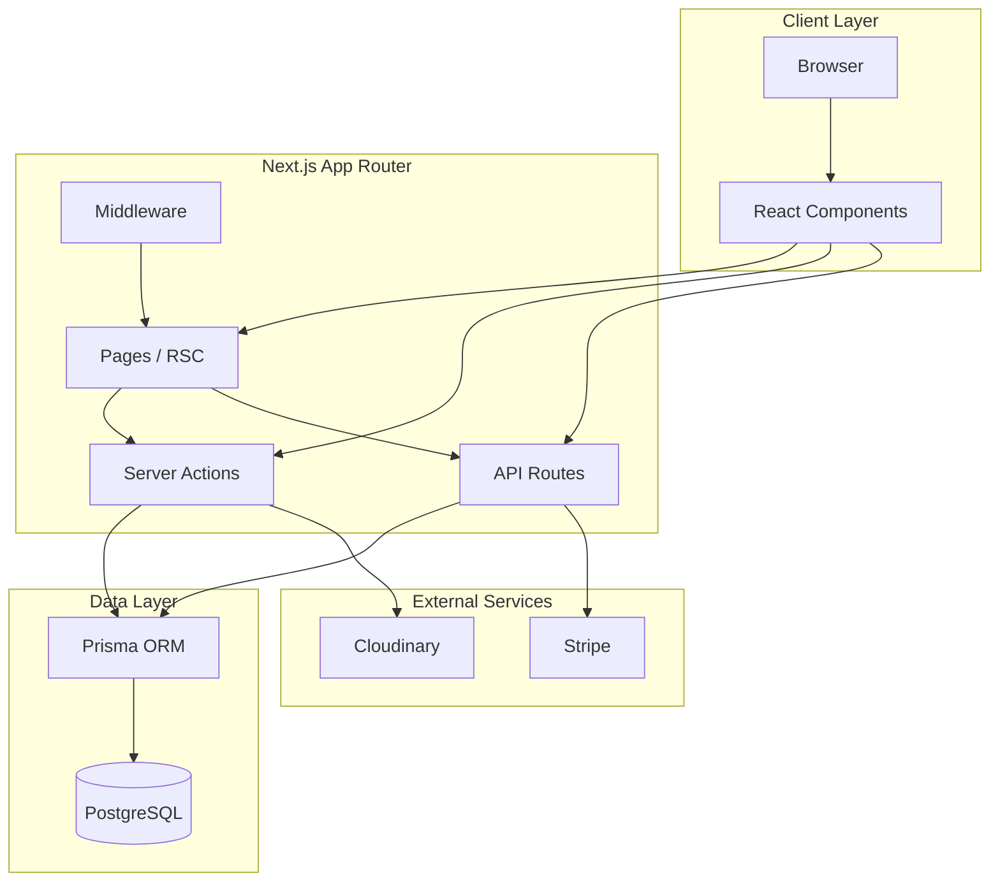
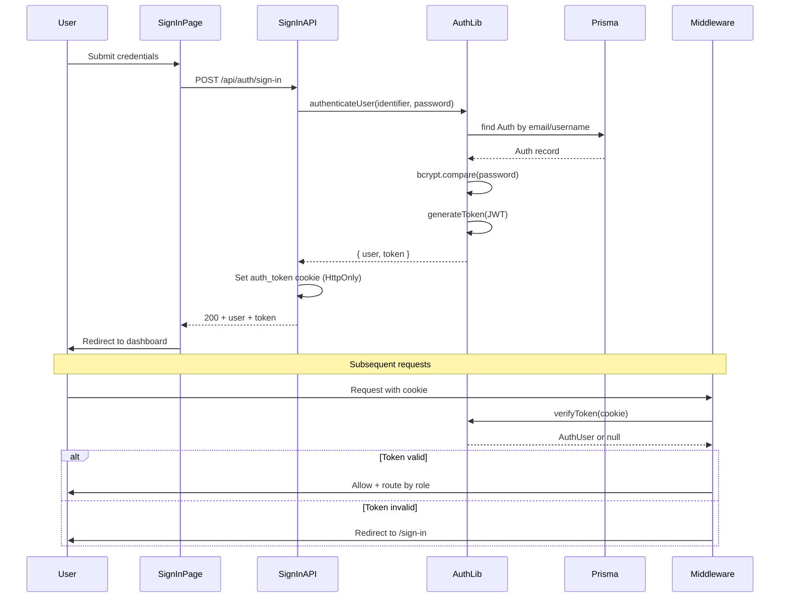
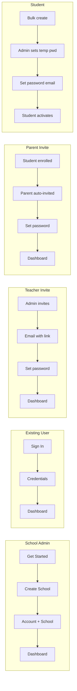
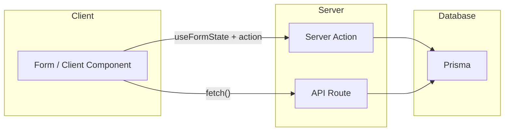
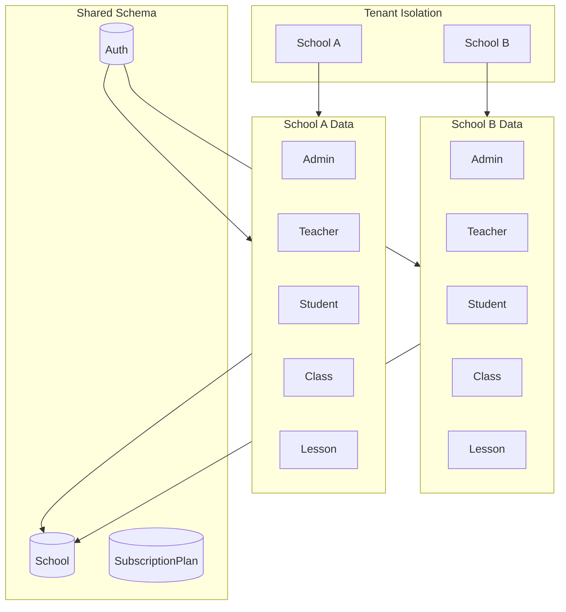
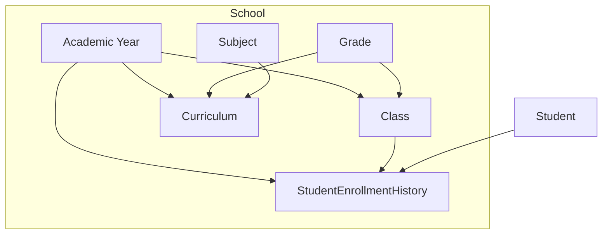
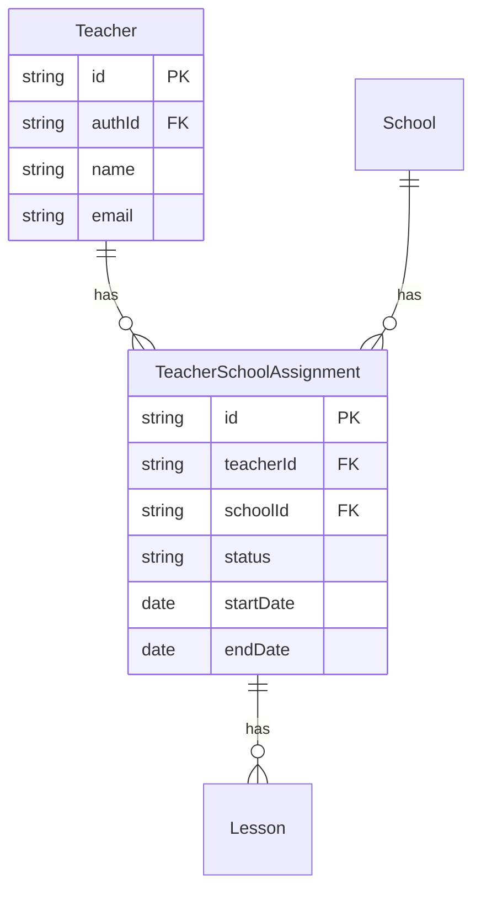
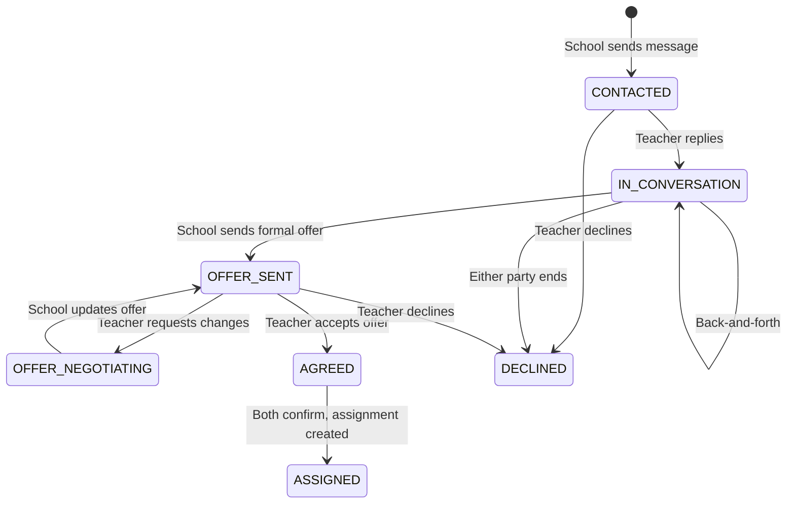
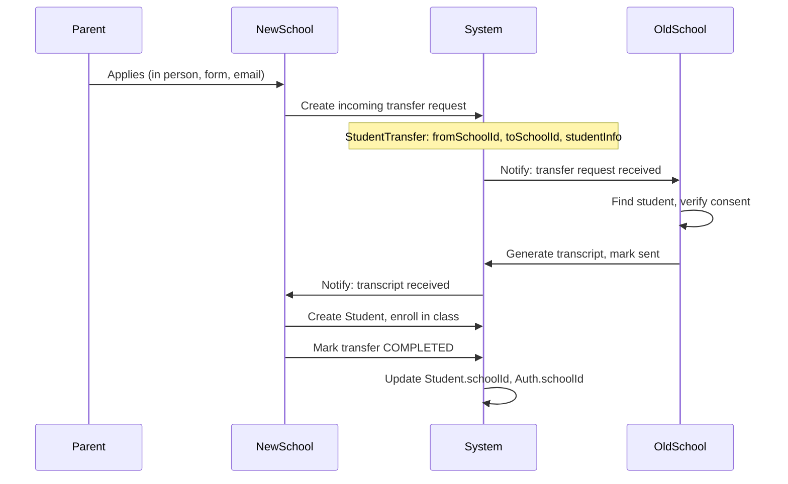
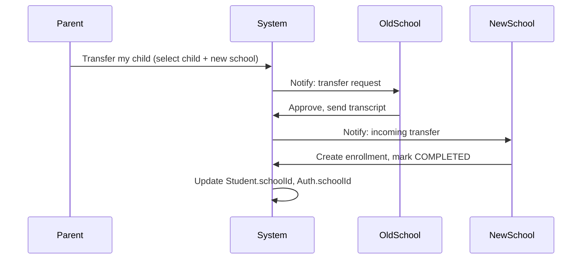

# Skooly System Design Analysis

## 1. Project Overview

**Skooly** is a multi-tenant school management SaaS platform built with Next.js 14, Prisma, PostgreSQL, and Stripe. Unlike traditional single-school systems, Skooly is designed as a **networked platform** where schools, teachers, and families connect across the ecosystem.

### 1.1 Core Capabilities

- **Five user roles**: Admin, Teacher, Student, Parent, System Admin — all in one unified app with role-based views
- **Academic operations**: Academic year management, classes, grades, subjects, curriculum, scheduling, lessons, exams, assignments, attendance, results
- **People management**: List pages and CRUD for teachers, students, parents; invite system; bulk import
- **Subscription billing**: Stripe integration for plan-based pricing per school

### 1.2 What Differentiates Skooly

| Aspect | Skooly |
|--------|--------|
| **Model** | Multi-tenant SaaS, subscription-based (Stripe) |
| **Teacher mobility** | Teacher marketplace (planned): teachers can work at multiple schools, discoverable by schools |
| **Student mobility** | Student transfer between schools (planned); parent access across children's schools |
| **Curriculum** | Optional country-based templates (France, USA, UK, Morocco, IB/Cambridge) |
| **Schedule changes** | Teacher-initiated requests (time change, swap); admin approves with conflict checks |
| **Cross-school** | Roadmap: sports leagues, alumni network, group purchasing, shared transport |
| **Tech stack** | Next.js 14, Prisma, PostgreSQL, Server Actions, App Router |

### 1.3 Tech Stack

- **Frontend/Backend**: Next.js 14 (App Router, Server Actions, RSC)
- **Database**: PostgreSQL via Prisma ORM
- **Auth**: Custom JWT (HttpOnly cookie), no third-party auth
- **Payments**: Stripe (subscriptions)
- **Media**: Cloudinary (images)

---

## 2. High-Level Architecture



**Key architectural decisions:**

- **Hybrid data access**: Server Actions (primary for CRUD) + REST API routes (auth, webhooks, subscriptions)
- **JWT-based auth**: Custom auth with `auth_token` HttpOnly cookie, no Clerk (removed)
- **Multi-tenant**: School-scoped data via `schoolId` on all entities
- **Middleware**: Route protection, role-based redirects, school isolation

---

## 3. Domain Model (Entity Relationship)

```mermaid
erDiagram
    School ||--o{ Auth : has
    School ||--o{ Admin : has
    School ||--o{ Teacher : has
    School ||--o{ Student : has
    School ||--o{ Parent : has
    School ||--o{ Grade : has
    School ||--o{ Class : has
    School ||--o{ Subject : has
    School ||--o{ Lesson : has
    School ||--o{ Room : has
    School ||--o{ AcademicYear : has
    School ||--o{ SchoolSubscription : has

    Auth ||--o| Admin : "1:1"
    Auth ||--o| Teacher : "1:1"
    Auth ||--o| Student : "1:1"
    Auth ||--o| Parent : "1:1"
    Auth ||--o| SystemAdmin : "1:1"

    AcademicYear ||--o{ Class : has
    AcademicYear ||--o{ Curriculum : has
    AcademicYear ||--o{ StudentEnrollmentHistory : has

    Grade ||--o{ Class : has
    Grade ||--o{ Curriculum : curriculumGrades
    Subject ||--o{ Curriculum : curriculumSubjects
    Subject ||--o{ Lesson : has
    Class ||--o{ Lesson : has
    Teacher ||--o{ Lesson : teaches
    Room ||--o{ Lesson : "RoomLessons"
    Room ||--o{ Event : "RoomEvents"

    Lesson ||--o{ Exam : has
    Lesson ||--o{ Assignment : has
    Lesson ||--o{ Attendance : has
    Student ||--o{ Attendance : has
    Student ||--o{ Result : has
    Exam ||--o{ Result : has
    Assignment ||--o{ Result : has

    Parent ||--o{ Student : has
    Class ||--o{ Student : enrolls
    Grade ||--o{ Student : enrolls

    Teacher ||--o{ TeacherAvailability : has
    Teacher ||--o{ ScheduleChangeRequest : "RequestedChanges"
    Teacher ||--o{ ScheduleChangeRequest : "ProposedSwaps"
    Lesson ||--o{ ScheduleChangeRequest : has

    SubscriptionPlan ||--o{ SchoolSubscription : has
    School ||--o{ SchoolSubscription : has

    School {
        string id PK
        string name UK
        string stripeCustomerId UK
        string activeAcademicYearId FK
    }

    Auth {
        string id PK
        string username UK
        string email UK
        string password
        string role
        string schoolId FK
    }

    SchoolSubscription {
        string id PK
        string schoolId FK
        string subscriptionPlanId FK
        string stripeSubscriptionId UK
        enum status
    }
```

---

## 4. Authentication Flow



**Auth components:**

- [src/lib/auth.ts](src/lib/auth.ts): `authenticateUser`, `verifyToken`, `requireAuth`, `requireRole`, `requireSchoolAccess`, `getCurrentUserOnPage`
- [src/middleware.ts](src/middleware.ts): Route protection, role-based redirects (`/schools/[schoolId]/[role]`, `/system/*` for system_admin)
- Token: JWT (HS256, 7d expiry), stored in `auth_token` HttpOnly cookie

---

## 5. User Onboarding Flows

### 5.1 Overview

```mermaid
flowchart TB
    subgraph entry [Entry Points]
        Landing[/]
        GetStarted[Get Started]
        SignIn[Sign In]
        InviteLink[Invite Link]
    end

    subgraph adminFlow [School Admin]
        CreateSchool[/create-school]
        AccountSchool[Account + School created]
        AdminDashboard[/schools/id/admin]
    end

    subgraph existingFlow [Existing User]
        SignInPage[/sign-in]
        Dashboard[/schools/id/role]
    end

    subgraph invitedFlow [Invited User]
        InvitePage[/invite/token]
        AcceptInvite[Set password + profile]
        InvitedDashboard[/schools/id/role]
    end

    Landing --> GetStarted
    GetStarted --> CreateSchool
    CreateSchool --> AccountSchool
    AccountSchool --> AdminDashboard

    Landing --> SignIn
    SignIn --> SignInPage
    SignInPage --> Dashboard

    InviteLink --> InvitePage
    InvitePage --> AcceptInvite
    AcceptInvite --> InvitedDashboard
```

### 5.2 School Admin (New School)

**Who:** Person creating a new school on the platform.

**Flow:** Single-step account + school creation.

| Step | Action | Location |
|------|--------|----------|
| 1 | User clicks "Get Started" | `/` or `/create-school` |
| 2 | Form: email, password, confirmPassword, schoolName | `/create-school` |
| 3 | Server Action: `createSchoolAndAssignAdmin` | Creates Auth + School + Admin in one transaction |
| 4 | Set cookie via `/api/auth/set-token` (new user) or redirect (existing user) | Client |
| 5 | Redirect to `/schools/[schoolId]/admin` | Dashboard |

**Existing user variant:** If already logged in (no school), form shows schoolName only; user is linked to new school as admin.

### 5.3 Existing User (Sign In)

**Who:** Admin, Teacher, Student, Parent, or System Admin with an existing account.

**Flow:**

| Step | Action | Location |
|------|--------|----------|
| 1 | User enters email/username + password | `/sign-in` |
| 2 | POST `/api/auth/sign-in` | Sets `auth_token` cookie |
| 3 | Redirect by role | |
| | system_admin | `/system/plans` |
| | admin | `/schools/[schoolId]/admin` |
| | teacher | `/schools/[schoolId]/list/teachers/[profileId]` or `/teacher` |
| | student | `/schools/[schoolId]/list/students/[profileId]` or `/student` |
| | parent | `/schools/[schoolId]/parent` |
| 4 | If no schoolId | Redirect to `/create-school` |

### 5.4 Invited User (Teacher, Student, Parent)

**Who:** Invited by admin to join an existing school.

**Flow:**

| Step | Action | Location |
|------|--------|----------|
| 1 | Admin sends invite (email, role, optional metadata) | Admin UI or bulk CSV |
| 2 | System creates Invite record, sends email with link | `/invite/[token]` |
| 3 | User clicks link | `/invite/[token]` |
| 4 | System validates token (exists, PENDING, not expired) | Server |
| 5 | User sets password (+ optional profile fields) | Accept form |
| 6 | System creates Auth + profile (Teacher/Student/Parent), marks invite ACCEPTED | Server Action |
| 7 | Redirect to dashboard | `/schools/[schoolId]/[role]` |

**Admin side:** See Section 6 (People Management) for sending invites. This section describes the invited user's flow.

### 5.5 Bulk Onboarding (Scale)

For schools with many users, admin uses bulk operations:

| Role | Method | How |
|------|--------|-----|
| **Teachers** | Bulk invite | CSV upload: email, role, name, subjects → create Invites, send emails |
| **Teachers** | Bulk create + invite | Extend bulk import: create profiles, send "Set your password" emails |
| **Parents** | Invite on enrollment | When admin creates/enrolls student, auto-invite parent (email from student record) |
| **Parents** | Bulk invite | CSV: email, studentIds → create Invites |
| **Students** | Bulk create | Admin bulk creates; send "Set password" email to parent (or student if email exists) |
| **Students** | Parent-managed | Parent creates account first; parent sets up student login when needed |

### 5.6 Onboarding Flow Diagram by Role



### 5.7 Route Summary

| Route | Purpose |
|-------|---------|
| `/` | Landing; "Get Started" → /create-school, "Sign In" → /sign-in |
| `/create-school` | New admin: create account + school |
| `/sign-in` | Existing users: authenticate |
| `/invite/[token]` | Invited users: accept invite, set password |

---

## 6. People Management

People management covers how admins add, edit, and remove teachers, students, and parents. It includes direct creation, the invite system, and bulk import.

### 6.1 List Pages and CRUD

| Role | List Page | CRUD | Detail Page |
|------|-----------|------|-------------|
| **Teachers** | `/list/teachers` | Create, update, delete | `/list/teachers/[id]` |
| **Students** | `/list/students` | Create, update, delete | `/list/students/[id]` |
| **Parents** | `/list/parents` | Create, update, delete | `/list/parents/[id]` |

- Search and filters (e.g. by class, grade, subject)
- Pagination
- Server Actions for all CRUD operations

### 6.2 Invite System

Admins add users by inviting them instead of creating accounts directly.

| Feature | Implementation |
|---------|----------------|
| **Send invite** | Admin enters email, role, optional metadata → system creates Invite, sends email with link |
| **Invite status** | PENDING, ACCEPTED, EXPIRED |
| **Resend** | Admin can resend pending invites |
| **Accept flow** | User clicks link → `/invite/[token]` → sets password → Auth + profile created, invite marked ACCEPTED (see Section 5.4 Invited User) |
| **Bulk invite** | CSV upload: email, role, name, … → create Invites, send emails |
| **Invite on enrollment** | When enrolling a student, optionally invite parent by email |

### 6.3 Bulk Import

| Entity | Method | Headers / Fields |
|--------|--------|------------------|
| **Students** | CSV upload | Username, password, name, grade, class, parent info, … |
| **Teachers** | CSV upload | Username, password, name, subjects, … |
| **Results** | CSV upload | Student, exam/assignment, score |

- Validation and error reporting
- Creates Auth + profile records
- Optional: send "Set your password" emails for bulk-created users

### 6.4 Relationship to Onboarding

| Flow | Section |
|------|---------|
| Admin sends invite | People Management (this section) |
| User receives email, clicks link, sets password | User Onboarding (Section 5.4) |
| Admin creates user directly (no invite) | People Management |
| Admin bulk imports | People Management |

---

## 7. Role-Based Access Control

```mermaid
flowchart TD
    subgraph roles [User Roles]
        SystemAdmin[System Admin]
        Admin[School Admin]
        Teacher[Teacher]
        Student[Student]
        Parent[Parent]
    end

    subgraph systemAdminAccess [System Admin Access]
        Plans[/system/plans]
        SchoolSubs[/system/school-subscriptions]
    end

    subgraph adminAccess [Admin Access]
        Teachers[/list/teachers]
        Students[/list/students]
        Subjects[/list/subjects]
        Schedule[/admin/schedule]
        BulkImport[/admin/bulk-import]
        Subscription[/admin/subscription]
    end

    subgraph teacherAccess [Teacher Access]
        MySchedule[/teacher/my-schedule]
        MyRequests[/teacher/my-requests]
        Availability[/teacher/availability]
        Attendance[/teacher/attendance]
    end

    subgraph sharedAccess [Shared Access]
        Exams[/list/exams]
        Assignments[/list/assignments]
        Results[/list/results]
        Events[/list/events]
        Announcements[/list/announcements]
    end

    SystemAdmin --> systemAdminAccess
    Admin --> adminAccess
    Admin --> sharedAccess
    Teacher --> teacherAccess
    Teacher --> sharedAccess
    Student --> sharedAccess
    Parent --> sharedAccess
```

**Access rules (from [src/middleware.ts](src/middleware.ts)):**

- `/schools/[schoolId]/*`: User must have `schoolId === schoolId` (no cross-school access)
- `/system/*`: Only `system_admin`
- Unauthenticated: Redirect to `/sign-in`

---

## 8. API Structure

| Route | Methods | Purpose |
|-------|---------|---------|
| `/api/auth/sign-in` | POST | Authenticate, set cookie |
| `/api/auth/sign-out` | GET | Clear cookie |
| `/api/auth/set-token` | POST | Set token (e.g. after sign-up) |
| `/api/auth/me` | GET | Current user (for Menu) |
| `/api/auth/sign-up` | POST | Register new user |
| `/api/schools/[schoolId]/academic-years` | GET, POST | Academic years CRUD |
| `/api/schools/[schoolId]/academic-years/[id]` | GET, PATCH, DELETE | Single academic year |
| `/api/schools/[schoolId]/academic-years/[id]/curriculum` | GET, POST | Curriculum |
| `/api/schools/[schoolId]/academic-years/[id]/classes/[classId]/enrollments` | GET, POST | Enrollments |
| `/api/schools/[schoolId]/rooms` | GET, POST | Rooms |
| `/api/schools/[schoolId]/rooms/[roomId]` | GET, PUT, DELETE | Single room |
| `/api/schools/[schoolId]/announcements` | GET | Announcements |
| `/api/schools/[schoolId]/subscriptions/subscribe` | POST | Stripe checkout |
| `/api/schools/[schoolId]/subscriptions/current` | GET | Current subscription |
| `/api/subscription-plans` | GET | Public plans |
| `/api/system_admin/subscription-plans` | GET, POST | Manage plans |
| `/api/system_admin/subscription-plans/[planId]` | GET, PUT, DELETE | Single plan |
| `/api/system_admin/school-subscriptions` | GET | All school subscriptions |
| `/api/system_admin/school-subscriptions/[id]` | GET, PUT | Single subscription |
| `/api/webhooks/payment` | POST | Stripe webhooks |

---

## 9. Data Flow: Server Actions vs API



**Primary pattern:** Server Actions in [src/lib/actions.ts](src/lib/actions.ts) handle most CRUD (subjects, classes, grades, lessons, exams, assignments, attendance, rooms, schedule change requests, etc.). Actions use `getCurrentUserSchoolId()` / `getVerifiedAuthUser()` for auth and `revalidatePath()` for cache invalidation.

**API routes** are used for: auth, Stripe checkout, webhooks, and some read-only endpoints (announcements, subscription plans).

---

## 10. Multi-Tenant Architecture



**Tenancy model:** Row-level isolation via `schoolId` on all school-scoped tables. No separate DB per tenant. Middleware enforces `user.schoolId === path schoolId`.

---

## 11. Academic Structure

### 11.1 Overview

The academic structure defines how schools organize grades, classes, subjects, curriculum, and student enrollment. It is the foundation for scheduling, lessons, exams, and attendance.



### 11.2 Core Entities

| Entity | Purpose |
|--------|---------|
| **AcademicYear** | Bounds a school year; classes, curriculum, and enrollments are scoped to it |
| **Grade** | School-level grade level (e.g. Grade 1, Grade 5, Kindergarten) |
| **Class** | A specific section within a grade for an academic year (e.g. "5A", "Grade 3-B") |
| **Subject** | School-level subject (e.g. Math, French, Science) |
| **Curriculum** | Links an academic year to grades and subjects (what is taught in each grade) |
| **StudentEnrollmentHistory** | Records which class/grade a student is in for a given academic year |

### 11.3 Enrollment as Source of Truth

**Target design:** `StudentEnrollmentHistory` is the canonical record of a student's class and grade for an academic year. `Student.classId` and `Student.gradeId` are derived and kept in sync.

| Rule | Implementation |
|------|----------------|
| **On enroll** | Create `StudentEnrollmentHistory`; set `Student.classId`, `Student.gradeId` from the enrollment |
| **On unenroll** | Mark enrollment inactive; clear `Student.classId`, `Student.gradeId` if no other active enrollment |
| **Display** | Use enrollment data for "current class/grade"; fall back to `Student` fields for legacy or single-enrollment views |

### 11.4 Curriculum Enforcement

Curriculum defines which subjects are taught in each grade. Lessons should reference curriculum entries to ensure consistency:

| Rule | Implementation |
|------|----------------|
| **Lesson creation** | Lesson's subject should belong to the class's grade curriculum |
| **Grade ordering** | Grades have a `sortOrder` for display (K, 1, 2, …) |
| **Capacity** | Class has optional `capacity`; enrollment checks capacity before adding |

### 11.5 Curriculum Templates by Country

School admins can optionally load a pre-built curriculum based on national education systems instead of creating from scratch.

#### 11.5.1 Benefits

| Benefit | Reason |
|---------|--------|
| **Time savings** | Schools avoid defining grades and subjects manually |
| **Standards alignment** | Matches national programmes (e.g. France, UK, US) |
| **Consistency** | Same labels mean similar content across schools |
| **Onboarding** | New schools can start quickly |

#### 11.5.2 Template Selection Flow

```
Admin → Academic Year → Curriculum setup

1. "How do you want to set up the curriculum?"
   - [Load from template] → Select country → Select system → Preview → Apply
   - [Start from scratch] → Current behavior
   - [Copy from previous year] → If school has past curriculum

2. For template: Select country (e.g. "France")
3. System suggests system (e.g. "Éducation Nationale - Programmes 2024")
4. Preview: Grade 1 → French, Math, …; Grade 2 → …
5. Admin can add/remove subjects before applying
6. Apply → Creates Curriculum entries for the academic year
```

#### 11.5.3 Template Data Model (Planned)

```prisma
model CurriculumTemplate {
  id          String   @id @default(cuid())
  countryCode String   // "FR", "US", "UK", "MA"
  systemName  String   // "Éducation Nationale", "Common Core", "National Curriculum"
  version     String?  // "2024", "2023"
  isActive    Boolean  @default(true)
  entries     CurriculumTemplateEntry[]
}

model CurriculumTemplateEntry {
  id          String   @id @default(cuid())
  templateId  String
  template    CurriculumTemplate @relation(...)
  gradeLevel  String   // "1", "2", "5", "K"
  subjectName String   // "Math", "Mathematics"
  sortOrder   Int      @default(0)
}
```

#### 11.5.4 Initial Systems to Support

| Country | System | Notes |
|---------|--------|-------|
| **France** | Éducation Nationale | National programmes |
| **USA** | Common Core (Math, ELA) | State variations later |
| **UK** | England National Curriculum | Scotland, Wales, NI later |
| **Morocco** | Programmes officiels | If relevant for target users |
| **International** | IB, Cambridge | For international schools |

#### 11.5.5 UX Summary

| Question | Answer |
|----------|--------|
| Should schools get pre-built curricula? | Yes, as an optional template |
| By country? | Yes, country + system (e.g. "France - Éducation Nationale") |
| When? | During curriculum setup for an academic year |
| Required? | No – "Start from scratch" and "Copy from previous year" remain |
| Implementation | Start with a few systems, expand over time |

### 11.6 Current vs Target State

| Aspect | Current | Target |
|--------|---------|--------|
| **Student class/grade** | `Student.classId` / `gradeId` may not sync with enrollment | Sync on enroll/unenroll |
| **Curriculum in lessons** | Not enforced | Lesson subject validated against curriculum |
| **Grade ordering** | No explicit order | `Grade.sortOrder` for display |
| **Enrollment capacity** | Not checked | Check `Class.capacity` before enroll |
| **Curriculum creation** | Manual only | Optional template by country |

---

## 12. Academic Activities

Academic activities are the day-to-day teaching and assessment operations built on top of the academic structure. All activities use enrollment as the source of truth for student–class relationships and respect academic year scope.

### 12.1 Lessons

Lessons are the core scheduling unit. Each lesson links a subject, class, teacher, room, day, and time slot.

| Feature | Implementation |
|---------|----------------|
| **CRUD** | Server Actions with conflict checks (teacher availability, teacher double-booking, class double-booking) |
| **Working hours** | 8:00–17:00, weekdays only |
| **Room assignment** | Optional room with capacity checks |
| **Curriculum enforcement** | Lesson subject must belong to the class's grade curriculum |
| **Academic year scope** | Classes scoped by academic year when creating lessons |
| **Teacher–subject validation** | Teacher must teach the subject |
| **List page** | Search/filter by class, teacher, subject |

### 12.2 Exams

Exams are formal assessments linked to lessons.

| Feature | Implementation |
|---------|----------------|
| **CRUD** | Server Actions |
| **Lesson link** | `lessonId` required; exams always tied to a lesson |
| **Role-based filtering** | Admin (all), teacher (own lessons), student (own class), parent (children) |
| **List page** | Subject, class, teacher, date; search by class, teacher, subject |

### 12.3 Assignments

Assignments are homework or tasks linked to lessons.

| Feature | Implementation |
|---------|----------------|
| **CRUD** | Server Actions |
| **Lesson link** | `lessonId` required |
| **Role-based filtering** | Admin, teacher, student, parent |
| **Student visibility** | Based on enrollment history for the active academic year |
| **List page** | Title, subject, class, teacher, due date |

### 12.4 Attendance

Attendance records student presence per lesson and date.

| Feature | Implementation |
|---------|----------------|
| **CRUD** | Server Actions |
| **Teacher flow** | Select lesson → take attendance for that lesson's class |
| **Student list** | From enrollment history (active enrollment for the lesson's class in the current academic year) |
| **Status values** | Present, Absent, Late |
| **Form/schema alignment** | Form sends `status`; schema expects `status`; update flow pre-fills from existing records |
| **Admin overview** | Recent attendance records |
| **Student/parent views** | Role-specific attendance pages |
| **Charts** | Attendance visualization components |

### 12.5 Results

Results store scores for exams and assignments.

| Feature | Implementation |
|---------|----------------|
| **CRUD** | Server Actions |
| **Link** | Either exam or assignment (mutually exclusive) |
| **Role-based filtering** | Admin (all), teacher (own lessons), student (own), parent (children) |
| **Null safety** | Handles exams/assignments with or without lessons |
| **Search** | By student, exam/assignment title |
| **Bulk import** | Bulk create results |

### 12.6 Curriculum

Curriculum defines which subjects are taught in each grade per academic year.

| Feature | Implementation |
|---------|----------------|
| **CRUD** | `curriculumActions.ts` (create, update, delete) |
| **Scope** | Academic year + grade |
| **Unique constraint** | One subject per grade per year |
| **Lesson enforcement** | Subject must be in curriculum for class's grade when creating lessons |
| **Templates** | Optional country-based templates (France, USA, UK, Morocco, IB/Cambridge) |
| **UI** | Curriculum page in academic year section |

### 12.7 Data Flow Summary

| Activity | Student Source | Curriculum Check | Academic Year Scope |
|----------|----------------|------------------|---------------------|
| Lessons | — | Yes | Yes (via class) |
| Exams | — | — | Yes (via lesson) |
| Assignments | Enrollment history | — | Yes (via lesson) |
| Attendance | Enrollment history | — | Yes (via lesson) |
| Results | — | — | Yes (via exam/assignment) |
| Curriculum | — | — | Yes |

### 12.8 Enrollment as Source of Truth

`StudentEnrollmentHistory` is the canonical record of a student's class and grade for an academic year. `Student.classId` and `Student.gradeId` are kept in sync on enroll/unenroll. Academic activities (attendance, assignments, etc.) use enrollment data to determine which students belong to a class for a given academic year.

---

## 13. Scheduling

Scheduling manages lessons across the week, room allocation, teacher availability, and schedule change requests. All schedule views are scoped by academic year and use enrollment as the source of truth for student–class relationships.

### 13.1 Admin Schedule

Admins manage the school schedule via an interactive calendar.

| Feature | Implementation |
|---------|----------------|
| **Calendar** | FullCalendar (timeGridWeek, timeGridDay) with drag-and-drop and resize |
| **Create lesson** | Select time slot → form pre-filled with day, time, optional class/teacher from filters |
| **Edit lesson** | Click event → update form |
| **Filters** | Class filter; teacher filter with availability overlay |
| **Teacher availability** | Unavailable slots shown as red background when a teacher is selected |
| **Room display** | Room shown on events when assigned |
| **Academic year scope** | Lessons and classes filtered by active (or selected) academic year |
| **Conflict checks** | Teacher overlap, class overlap, room overlap, teacher availability |
| **Events** | School events (meetings, holidays) shown on the same calendar |

### 13.2 Teacher Schedule

Teachers view their schedule and request changes.

| Feature | Implementation |
|---------|----------------|
| **View** | Calendar or list by day |
| **Request change** | "Request Change/Swap" per lesson → modal with TIME_CHANGE or SWAP |
| **TIME_CHANGE** | Proposed day, start time, end time |
| **SWAP** | Proposed swap teacher (filtered by subject) |
| **Cancel** | Teacher can cancel PENDING requests |
| **Notifications** | Notified when request is approved or rejected |

### 13.3 Schedule Change Requests

Teachers request changes; admins approve or reject.

| Feature | Implementation |
|---------|----------------|
| **Create** | TIME_CHANGE or SWAP with validation |
| **Admin page** | Pending requests with approve/reject |
| **Approve** | Updates lesson (time or teacher) after conflict checks |
| **Conflict checks on approve** | Teacher overlap, class overlap, room overlap |
| **Swap validation** | Proposed teacher must teach the subject |
| **Reject** | Optional admin notes; teacher notified |

### 13.4 Student Schedule

Students see their class schedule for the current academic year.

| Feature | Implementation |
|---------|----------------|
| **Data source** | Enrollment history for active academic year (not `Student.classId`) |
| **Display** | BigCalendar with lessons for enrolled class |
| **Null handling** | "No schedule" when not enrolled; no crash on missing class |
| **Academic year** | Only lessons for the active year |

### 13.5 Parent Schedule

Parents see schedules for each enrolled child.

| Feature | Implementation |
|---------|----------------|
| **Data source** | Enrollment history per child for active academic year |
| **Display** | One schedule per child (tabs or stacked layout) |
| **Null handling** | Skips or shows "No schedule" for unenrolled children |
| **Empty state** | Handles parents with no children or no enrolled children |

### 13.6 updateLessonTime (Drag/Resize)

When admins drag or resize lessons on the calendar:

| Feature | Implementation |
|---------|----------------|
| **Updates** | Day, startTime, endTime |
| **Conflict checks** | Teacher overlap, class overlap, room overlap, teacher availability |
| **Revert** | Reverts on conflict or error |

### 13.7 Room Conflict Prevention

Room double-booking is prevented across all scheduling flows.

| Flow | Check |
|------|-------|
| **createLesson** | Room not already used at same day/time |
| **updateLesson** | Same as create |
| **updateLessonTime** | Same for new day/time |
| **Approve TIME_CHANGE** | Same for proposed day/time |

### 13.8 Data Flow Summary

| View | Lesson Source | Academic Year | Student Source |
|------|---------------|---------------|----------------|
| Admin schedule | All lessons (filtered by class/teacher) | Active year | — |
| Teacher schedule | Teacher's lessons | Active year | — |
| Student schedule | Class lessons | Active year | Enrollment |
| Parent schedule | Class lessons per child | Active year | Enrollment |

### 13.9 Recurring Model

Lessons are weekly recurring: each lesson has `day`, `startTime`, `endTime` and repeats every week. `adjustScheduleToCurrentWeek` maps them to the current week for display. Events (meetings, holidays) are date-specific and shown alongside lessons on the admin calendar.

---

## 14. Teacher Marketplace (Planned)

### 14.1 Overview

The Teacher Marketplace allows schools to discover and recruit teachers who are open to new opportunities. Teachers can work at multiple schools; the marketplace facilitates discovery, contact, and assignment.

**Key concepts:**
- **Multi-school teachers** – A teacher can have assignments at multiple schools
- **Marketplace profile** – Teachers opt in to be discoverable; schools browse and search
- **Contact flow** – Conversation → offer → agreement → assignment (not instant accept)

### 14.2 Multi-School Support

Teachers are linked to schools via a junction table instead of a direct `schoolId`:



- **Teacher** – One record per person (profile)
- **TeacherSchoolAssignment** – One record per school the teacher works at; lessons reference the assignment

### 14.3 Marketplace Profile

Teachers opt in to be discoverable. Profile includes structured availability (Option B) for time-saving matching:

| Field | Purpose |
|-------|---------|
| headline | e.g. "Math & Physics Teacher, 5 years experience" |
| bio | Free-text description |
| subjectsOffered | Subjects they can teach |
| availabilityType | FULL_TIME, PART_TIME, SUBSTITUTE, TUTORING |
| **availabilitySlots** | Structured: `[{ day, startTime, endTime }, ...]` – schools see exact free slots |
| availabilityUpdatedAt | "Last updated" timestamp |
| isActive | Teacher can pause visibility |

**Availability display (Option B):**
```
Availability for new work:
• Monday    09:00 – 12:00
• Wednesday 09:00 – 15:00
• Friday    14:00 – 17:00
Last updated: 3 days ago
```

### 14.4 Contact Flow (Not Instant Assign)

When a school contacts a teacher, the flow is conversational:



| Stage | Description |
|-------|-------------|
| CONTACTED | School sent initial message |
| IN_CONVERSATION | Messages exchanged |
| OFFER_SENT | School sent formal offer (subjects, dates, hours) |
| OFFER_NEGOTIATING | Teacher requested changes |
| AGREED | Both confirmed terms |
| ASSIGNED | TeacherSchoolAssignment created |
| DECLINED | Contact ended |

### 14.5 Key Models (Planned)

```prisma
model TeacherMarketplaceProfile {
  id                String   @id @default(cuid())
  teacherId         String   @unique
  teacher           Teacher  @relation(...)
  headline          String?
  bio               String?  @db.Text
  subjectsOffered   String[]
  availabilityType  String?
  availabilitySlots Json?    // [{ day, startTime, endTime }, ...]
  availabilityUpdatedAt DateTime?
  isActive          Boolean  @default(true)
  viewCount         Int      @default(0)
  contactCount      Int      @default(0)
}

model SchoolTeacherContact {
  id           String   @id @default(cuid())
  schoolId     String
  teacherId    String
  initiatedBy  String
  status       String   // CONTACTED, IN_CONVERSATION, OFFER_SENT, AGREED, ASSIGNED, DECLINED
  initialMessage String? @db.Text
  messages     ContactMessage[]
  offer        ContactOffer?
}

model ContactMessage {
  id         String   @id @default(cuid())
  contactId  String
  senderId   String
  senderType String   // SCHOOL | TEACHER
  content    String   @db.Text
  createdAt  DateTime @default(now())
}

model ContactOffer {
  id          String   @id @default(cuid())
  contactId   String   @unique
  subjects    Int[]
  startDate   DateTime?
  hoursPerWeek Float?
  status      String   // PENDING, ACCEPTED, REJECTED, COUNTERED
}
```

### 14.6 Flow Summary

| Actor | Action |
|-------|--------|
| Teacher | Opts in, sets profile + structured availability slots |
| School | Browses marketplace, filters by subject/availability |
| School | Views teacher profile (sees availability slots) |
| School | Sends contact message |
| Both | Conversation (messages) |
| School | Sends formal offer (optional) |
| Teacher | Accepts/declines/negotiates offer |
| Both | Agree on terms |
| System | Creates TeacherSchoolAssignment |

---

## 15. Student Transfer (Planned)

### 15.1 Overview

Students can transfer from one school to another. The transfer uses a simple model: update `Student.schoolId` when the transfer is completed. Parents can have children at different schools; each student is at one school at a time.

**Key rules:**
- **Student** – One school at a time; `schoolId` updated on transfer
- **Parent** – Can have children at different schools; access derived from children's schools
- **Transfer** – Request → transcript → enrollment → update `schoolId`

### 15.2 Who Initiates

| Initiator | When | Flow |
|-----------|------|------|
| **New school** (primary) | Parent has applied to new school | New school creates incoming transfer request; old school sends transcript; new school enrolls |
| **Parent** | Both schools on Skooly, parent uses app | Parent requests transfer; old school approves and sends transcript; new school enrolls |
| **Old school** | Parent gave notice they're leaving | Old school creates transfer-out; prepares transcript for new school or parent |

### 15.3 Transfer Flow (New School Initiates)



### 15.4 Transfer Flow (Parent Initiates)



### 15.5 Parent Multi-School Access

Parents derive school access from their children:

| Rule | Implementation |
|------|----------------|
| Parent's schools | `students.map(s => s.schoolId).distinct` |
| Access check | Parent can access `/schools/[schoolId]` if they have a Student with that `schoolId` |
| Schema | Remove or relax `Parent.schoolId`; access derived from children |

When a child transfers, the parent gains access to the new school and may lose access to the old school if they have no other children there.

### 15.6 Key Model (Planned)

```prisma
model StudentTransfer {
  id              String    @id @default(cuid())
  studentId       String?
  student         Student?  @relation(...)
  fromSchoolId    String
  fromSchool      School    @relation("TransfersFrom", ...)
  toSchoolId      String
  toSchool        School    @relation("TransfersTo", ...)
  initiatedBy     String    // Auth ID
  initiatorType   String    // NEW_SCHOOL | PARENT | OLD_SCHOOL
  status          String    // PENDING, TRANSCRIPT_SENT, ENROLLED, COMPLETED, REJECTED
  studentInfo     Json?     // Name, DOB, parent contact (when student not yet in system)
  transcriptSentAt DateTime?
  completedAt     DateTime?
  createdAt       DateTime  @default(now())
}
```

### 15.7 UI Placement

| Initiator | Location |
|-----------|----------|
| New school | Admin → Students → "Add incoming transfer" / "Enroll transferring student" |
| Parent | Parent dashboard → "Transfer my child" or student profile → "Request transfer" |
| Old school | Admin → Students → select student → "Transfer out" |

### 15.8 Records Handling

| Data | Handling |
|------|----------|
| Old results, attendance | Stay at old school (historical) |
| Transcript | Generated by old school; sent to new school for placement |
| New enrollment | New school creates class/grade enrollment |

---

## 16. External Integrations

| Service | Usage |
|---------|-------|
| **Stripe** | Subscription plans, checkout, webhooks (`checkout.session.completed`, `customer.subscription.*`) |
| **Cloudinary** (next-cloudinary) | Image uploads (profile, etc.) |
| **PostgreSQL** | Primary database via Prisma |

---

## 17. Key File References

| Purpose | Path |
|---------|------|
| Auth logic | [src/lib/auth.ts](src/lib/auth.ts) |
| Route protection | [src/middleware.ts](src/middleware.ts) |
| Server Actions | [src/lib/actions.ts](src/lib/actions.ts) |
| Prisma schema | [prisma/schema.prisma](prisma/schema.prisma) |
| Dashboard layout | [src/app/(dashboard)/layout.tsx](src/app/(dashboard)/layout.tsx) |
| Navigation | [src/components/Menu.tsx](src/components/Menu.tsx) |
| Roadmap | [ECOSYSTEM_ROADMAP.md](ECOSYSTEM_ROADMAP.md) |

---

## 18. Implemented Features

The following parts of the app are already developed:

### 18.1 Core Platform

- Multi-tenant school management
- User roles (Admin, Teacher, Student, Parent, System Admin)
- JWT-based authentication (custom, HttpOnly cookie)
- Role-based access control and route protection
- Subscription management (Stripe integration)

### 18.2 People Management

- List pages and CRUD for teachers, students, parents
- Profile detail pages
- **Invite system** (send invite, accept flow at `/invite/[token]`, resend, bulk invite, invite on enrollment)
- Bulk import (students, teachers, results via CSV)

### 18.3 Academic Structure

- Academic year management
- Classes, Grades, Subjects
- Curriculum management (per academic year, per grade)
- Student enrollment history

### 18.4 Scheduling & Academic Activities

- Lessons and scheduling (FullCalendar, drag/drop, resize)
- Teacher availability management
- Schedule change requests (teacher-initiated time change/swap, admin approve/reject)
- Room/venue management
- Exams, Assignments, Results
- Attendance tracking

### 18.5 Other

- Events and Announcements
- Basic analytics (charts for attendance, counts, finance)

---

## 19. Planned Features (from ECOSYSTEM_ROADMAP)

### 19.1 Core Missing Features

- Messaging & communication (WebSockets/SSE, direct and group messaging)
- Fee management and billing (student fees, payment tracking)
- Library management
- Transportation management
- Document management
- Advanced reporting and analytics
- Gradebook and transcript generation
- Notification system
- Parent-teacher conference scheduling

### 19.2 Cross-School Ecosystem

- **Teacher marketplace** (multi-school support, discovery, contact flow, structured availability)
- **Student transfer** (simple transfer, parent multi-school, new school / parent / old school initiation)
- Cross-school sports leagues & tournaments
- Alumni network across schools
- Group purchasing & bulk buying
- Shared transportation routes
- Cross-school parent networks
- Emergency response coordination
- Shared extracurricular activities
- Inter-school certification & accreditation
