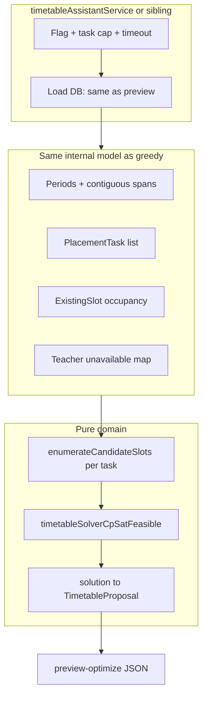

# Phase F.2 — Feasibility CP-SAT: implementation plan

This document **plans and describes** how we will implement **Milestone F.2** from [TIMETABLE_SOLVER_PHASE_F_DESIGN.md](./TIMETABLE_SOLVER_PHASE_F_DESIGN.md) (§4 hard constraints, §6.2–6.3, §9, §10 F.2, §13 limits). It does **not** replace the product design doc; it is the engineering execution guide.

**Parent status:** F.0 locked, F.1 complete. **F.2 next:** feasibility-only solver; **no** soft objectives (that is F.3).

---

## 1. Goal and acceptance (from design doc)

| Item | Target |
|------|--------|
| **Functional** | Given the same inputs as greedy (periods, expanded **placement tasks**, existing occupancy, teacher unavailable map), find **any** assignment of each task to one **discrete slot** such that §4 hard rules hold, or return **infeasible** with a useful message. |
| **Parity** | Teacher unavailability uses [`timetableTeacherAvailability.ts`](../../src/lib/domain/timetableTeacherAvailability.ts); bell validity uses existing period-span rules ([`bellPeriodRules`](../../src/lib/domain/bellPeriodRules.ts), same spirit as [`validateLessonTimesAgainstBellPolicy`](../../src/lib/domain/bellPeriodRules.ts) used on commit). |
| **API** | New routes only (do **not** overload greedy preview body): `POST .../timetable-assistant/preview-optimize` and, if needed, `.../preview-optimize-school` — behind **`TIMETABLE_SOLVER_ENABLED=1`**. |
| **Limits** | Max **300** placement tasks; **30s** wall-clock timeout; structured error on timeout / infeasible. |
| **Tests** | Vitest: tiny grids (feasible + infeasible); golden mapping from solution → `TimetableProposal[]` matches greedy types for downstream validation. |

**Explicitly out of scope for F.2:** soft goals (§5), weighted objective (F.3), admin UI toggle (F.4), changing greedy default behavior.

---

## 2. Architecture (high level)

**Principle:** Candidate generation is **deterministic** and **shared-testable** without the solver. The CP-SAT layer only chooses **one** index per task from each task’s finite candidate list.

---

## 3. Workstreams

### 3.0 Dependency spike — **resolved** (2026-03-20)

**Decision:** **Python FastAPI** microservice with official **`ortools`** ([`services/timetable-solver/`](../../services/timetable-solver/)); Next.js calls `POST /solve-feasibility` with JSON (candidate counts + conflict tuples). No in-process Node OR-Tools.

| Step | Action |
|------|--------|
| A | ~~Survey Node bindings~~ — skipped in favor of Python OR-Tools. |
| B | Service + `pytest` + TS unit tests with mocked `fetch`. |
| C | **Pinned:** `requirements.txt` in solver folder; parent doc §13 updated. |

---

### 3.1 Shared feasibility module — `timetableFeasibility.ts` (name per §9.1)

**Responsibility:** Bridge **grid geometry** (Mon–Fri × contiguous period spans) to a finite **slot index space**.

**Core types (suggested):**

- `CandidateSlot`: `{ slotIndex: number; day: Day; startPeriodId: string; endPeriodId: string | null; startTime: Date; endTime: Date }` — or equivalent with stable `slotIndex` 0…N-1 global enumeration.
- `enumerateCandidatesForTask(task, sortedPeriods, existing, unavailableByTeacher)`: returns ordered list of feasible slots **for that task alone** (respect `blockSize` via `listContiguousPeriodSpans`, teacher unavailable via `lessonOverlapsTeacherUnavailable`, and optionally **prune** slots that can never work — see below).

**Pruning strategy (F.2):**

- **Minimum viable:** For each task, include every `(day, span)` that passes: bell-shaped times from `computeLessonTimesFromPeriodSpan` (same as greedy), **not** overlapping teacher unavailability for that teacher/day, and **not** conflicting with **fixed** occupancy for teacher/class/room (same predicates as `conflictsWithOccupancy` in [`timetableAssistant.ts`](../../src/lib/domain/timetableAssistant.ts)).
- **Important:** Pairwise conflicts between **new** tasks are **not** pruned here — they are **CP-SAT clauses** (§3.2). Do not duplicate “global feasibility” inside enumeration beyond existing lessons.

**Empty candidate list:** Task cannot be placed → overall problem infeasible (surface early without calling the solver, or let solver have zero literals — prefer **early explicit error**).

**Reuse:** Import `TIMETABLE_WEEKDAYS`, `listContiguousPeriodSpans`, `anchorForWeekday` / lesson time helpers from existing module (export if currently internal).

---

### 3.2 CP-SAT model — `timetableSolverCpSatFeasible.ts` (or similar, §9.3)

**Variables:** For each task `i` with `K_i` candidates, introduce integer `choice[i] ∈ {0 .. K_i-1}` **or** one-hot booleans `x[i,k]` with `Σ_k x[i,k] = 1`. One-hot is often easier for pairwise incompatibility.

**Incompatibility edges:** For each pair of tasks `(i, j)` and candidate indices `(k, l)` such that placing both would violate **teacher**, **class**, or **room** overlap (same interval overlap test as occupancy), add constraint `NOT (x[i,k] AND x[j,l])` → linear: `x[i,k] + x[j,l] ≤ 1`.

**Scope:** Only tasks in the current request; **existing** lessons are already reflected as **removed** or **fixed** occupancy in the same way as greedy preview (`ExistingSlot`).

**Objective:** **None** for F.2 (feasibility only). CP-SAT “find any feasible solution.”

**Solver call:** Time limit **30s** (match §13); if `UNKNOWN` or timeout → return domain error `{ code: 'SOLVER_TIMEOUT' }` or similar.

**Infeasible:** If solver returns infeasible, return `{ code: 'INFEASIBLE', message: '…' }` — optional follow-up (F.2.1): extract minimal unsat core or small human hint — **best-effort**, not blocking F.2.

---

### 3.3 Solution → `TimetableProposal[]`

Map chosen slot per task to the existing **`TimetableProposal`** shape (same as [`computeTimetablePreview`](../../src/lib/domain/timetableAssistant.ts)) so:

- [`runTimetableAssistantCommit`](../../src/lib/timetableAssistantService.ts)-style validation (bell policy, `teacherUnavailableMessage`) can **reuse** the same post-pass as greedy preview, or we **assert** parity in unit tests.

**Naming / subject strings:** Reuse `subjectNameById` + `className` / `classNameById` from service when building proposals (same as greedy).

---

### 3.4 Service layer and routes

| Piece | Behavior |
|-------|----------|
| **Flag** | Read `process.env.TIMETABLE_SOLVER_ENABLED === '1'` (or project convention). If off → `403` / `501` / domain “solver disabled” — pick one and document. |
| **Task cap** | Before solver: if `placementTasks.length > 300` → reject with clear error (§13). |
| **Data** | Reuse the same loading path as `runTimetableAssistantPreview` / `runTimetableAssistantSchoolPreview`: periods, requirements expansion to tasks, existing lessons filter, `loadTeacherUnavailableMapByTeacherId`. |
| **Policy** | After solver: run existing `validateTimetableProposalBellPolicy` loop (already in preview) — any failure should be treated as **bug** in enumeration (fix slot generation). |

**Routes (new files):**

- `src/app/api/schools/[schoolId]/timetable-assistant/preview-optimize/route.ts`
- `src/app/api/schools/[schoolId]/timetable-assistant/preview-optimize-school/route.ts` (if school body differs — mirror `preview` vs `preview-school`)

**Auth / validation:** Same admin guards and Zod bodies as existing timetable-assistant routes; **reuse** `timetableAssistantBodySchema` / school schema from [`formValidationSchemas`](../../src/lib/formValidationSchemas.ts).

**No UI in F.2** per milestone — optional `curl`/internal test only; F.4 adds toggle.

---

### 3.5 Testing strategy

| Layer | What |
|-------|------|
| **Unit** | `enumerateCandidatesForTask` — known period grid, unavailable Monday → no Monday slots. |
| **Unit** | CP-SAT wrapper — two tasks, one slot conflict → infeasible; two tasks, two disjoint slots → feasible. |
| **Integration** | Service function with mocked periods/tasks (or minimal seed) — end-to-end JSON shape. |
| **Contract** | Response matches `TimetableAssistantPreviewPayload` shape where applicable (preview + policyErrors pattern). |

**CI:** Keep solver tests **fast** (< few seconds); stress tests optional / nightly if needed.

---

### 3.6 Documentation updates (when F.2 ships)

| Doc | Update |
|-----|--------|
| [TIMETABLE_SOLVER_PHASE_F_DESIGN.md](./TIMETABLE_SOLVER_PHASE_F_DESIGN.md) | Mark F.2 complete with date; link this file + solver module paths. |
| [TIMETABLE_ASSISTANT_MVP.md](./TIMETABLE_ASSISTANT_MVP.md) | Table row for `preview-optimize` endpoints; flag + limits. |
| [LESSON_SCHEDULING_AND_TIMETABLE_GUIDE.md](../scheduling/LESSON_SCHEDULING_AND_TIMETABLE_GUIDE.md) | §8 one paragraph on optional CP-SAT preview (env-gated). |
| This file | Move “spike” decisions from §3.0 into a short **“Resolved”** appendix. |

---

## 4. Implementation order (recommended)

1. **§3.0** Dependency spike and pin.
2. **§3.1** `timetableFeasibility.ts` + Vitest (no OR-Tools).
3. **§3.2** CP-SAT model + tiny fixtures.
4. **§3.3** Map to `TimetableProposal` + parity test with bell/unavailable helpers.
5. **§3.4** Service helpers + routes + flag + caps + timeout.
6. **§3.6** Docs + parent milestone checkbox.

---

## 5. Risks and mitigations (F.2-specific)

| Risk | Mitigation |
|------|------------|
| OR-Tools unavailable or too heavy in Node | Spike first; document fallback; keep enumeration pure so solver is swappable. |
| **Variable explosion** | 300-task cap; incompatibility graph may be dense — monitor solve time; consider sparse conflict lists only for overlapping candidate pairs. |
| **Drift** vs greedy | Single source for “slot feasibility” predicates (unavailability + occupancy); unit tests assert same as `lessonOverlapsTeacherUnavailable` + `conflictsWithOccupancy`. |

---

## 6. Document history

| Date | Change |
|------|--------|
| 2026-03-20 | Initial F.2 implementation plan (engineering), aligned with TIMETABLE_SOLVER_PHASE_F_DESIGN.md. |
| 2026-03-20 | F.2 implemented: Python solver + `timetableFeasibility` / `timetableSolverFeasibility` + `preview-optimize` routes. |
